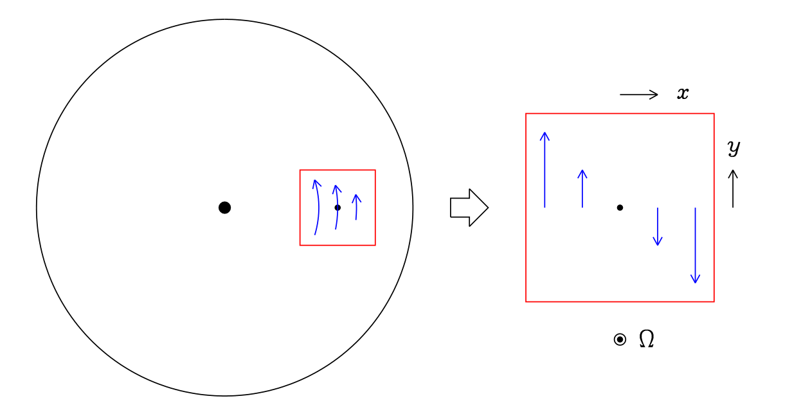

# dynamics of astrophysical discs

the [lecture notes](/read/ogilvie-disk-dynamics.pdf) *dynamics of astrophysical discs*

results below are just reshowed from the lecture notes, the derivation could be find in the notes.

## lecture 2: Orbital dynamics

### 2.1 Orbits in an axisymmetric potential

- the effective potential
  $$
  \Phi^{\text{eff}}=\frac{h^2}{2r^2}+\Phi
  $$

for the family of circular orbits ( $r=$ constant ) in the midplane ( $z=0$ )

- the specific angular momentum
  $$
  h_c=\sqrt{r^3\Phi_r(r,0)}
  $$

- the angular velocity
  $$
  \Omega_c=\frac{h_c}{r^2}
  $$

- the specific energy
  $$
  \varepsilon_c=\frac{h_c^2}{2r^2}+\Phi(r,0)
  $$

- the orbital shear rate
  $$
  S=-r\frac{\mathrm{d}\Omega_c}{\mathrm{d}r}
  $$

- the dimensionless orbital shear parameter
  $$
  q=-\frac{\mathrm{d}\ln\Omega_c}{\mathrm{d}\ln r}=\frac{S}{\Omega_c}
  $$

::: info e.g.
In the case of a point-mass potential, the circular Keplerian orbits satisfy
$$
\Phi(r,0)=-\frac{GM}{r}
$$
$$
h_c=\sqrt{GMr}
$$
$$
\Omega_c=\sqrt{\frac{GM}{r^3}}
$$
$$
\varepsilon_c=-\frac{GM}{2r}
$$
$$
S=\frac{3}{2}\Omega_c
$$
$$
q=\frac{3}{2}
$$
:::

### 2.2 Oscillations and precession

- Oscillations:
  
  1. the radial frequency (often called the epicyclic frequency and denoted $\kappa$ )
   $$
   \Omega_r^2=\Phi^{\text{eff}}_{rr}(r,0)=4\Omega_c^2+2r\Omega_c\frac{\mathrm{d}\Omega_c}{\mathrm{d}r}=2(2-q)\Omega_c^2
   $$
   $$
   \ddot{\delta r}=-\Omega_r^2\delta r
   $$

  2. the vertical frequency (sometimes denoted $\nu$ )
   $$
   \Omega_z^2=\Phi^{\text{eff}}_{zz}(r,0)
   $$
   $$
   \ddot{\delta z}=-\Omega_z^2\delta z
   $$

  Keplerian orbits satisfy
  $$
  \Omega_r=\Omega_z=\Omega
  $$
  meaning that (slightly) eccentric or inclined orbits close after one turn.

- precession:
  1. the apsidal precession rate
   $$
   \Omega-\Omega_r
   $$
  2. the nodal precession rate
   $$
   \Omega-\Omega_z
   $$

### 2.3 Mechanics of accretion

- transfer of angular momentum:
  
  consider two particles in circular orbits in the midplane. the total angular momentum and energy are
  $$
  H=H_1+H_2=m_1h_1+m_2h_2,
  $$
  $$
  E=E_1+E_2=m_1\varepsilon_1+m_2\varepsilon_2
  $$

  in an infinitesimal exchange:
  $$
  \mathrm{d}H=\mathrm{d}H_1+\mathrm{d}H_2=m_1\mathrm{d}h_1+m_2\mathrm{d}h_2,
  $$
  $$
  \mathrm{d}E=\mathrm{d}E_1+\mathrm{d}E_2=m_1\Omega_1\mathrm{d}h_1+m_2\Omega_2\mathrm{d}h_2
  $$

  if $\mathrm{d}H=0$ then
  $$
  \mathrm{d}E=(\Omega_1-\Omega_2)\mathrm{d}H_1
  $$

- transfer of angular momentum and mass:
  $$
  \begin{align}
  \mathrm{d}M&=\mathrm{d}m_1+\mathrm{d}m_2=0, \\
  \mathrm{d}H&=\mathrm{d}H_1+\mathrm{d}H_2=0,\quad\mathrm{d}H_i=m_i\mathrm{d}h_i+h_i\mathrm{d}m_i, \\
  \mathrm{d}E_i&=m_i\Omega_i\mathrm{d}h_i+\varepsilon_i\mathrm{d}m_i \\
  &=\Omega_i\mathrm{d}H_i+(\varepsilon_i-h_i\Omega_i)\mathrm{d}m_i, \\
  \mathrm{d}E&=(\Omega_1-\Omega_2)\mathrm{d}H_1+[(\varepsilon_1-h_1\Omega_1)-(\varepsilon_2-h_2\Omega_2)]\mathrm{d}m_1
  \end{align}
  $$

## lecture 3: Global and local views

### 3.1 Local view of orbital dynamics

- local coordinates $(x,y,z)$
  $$
  r=r_0+x,\quad\phi=\Omega_0t+\frac{y}{r_0},\quad z=z.
  $$

- the tidal potential
  $$
  \begin{align}
  \Phi_t&=\frac{1}{2}\left(\left.\frac{\partial^2\Phi}{\partial r^2}\right|_{r_0}-\Omega_0^2\right)x^2+\frac{1}{2}\left.\frac{\partial^2\Phi}{\partial z^2}\right|_{r_0}z^2 \\
  &=-\Omega_0S_0x^2+\frac{1}{2}\Omega_{z0}^2z^2
  \end{align}
  $$

- the local representation of the family of circular orbits in the midplane is
  $$
  x=\text{constant},\quad\dot{y}=-S_0x,\quad z=0
  $$

  ::: details derivation
  start from the definition of local coordinates $y$:
  $$
  \phi=\Omega_0t+\frac{y}{r_0}
  $$
  the first derivative of time above is:
  $$
  \Omega_c=\Omega_0+\frac{\dot{y}}{r_0}
  $$
  $$
  \begin{align}
  \Rightarrow \dot{y}&=r_0(\Omega_c-\Omega_0) \\
  &=r_0x\frac{\Omega_c-\Omega_c|_{r_0}}{r-r_0} \\
  &=xr_0\frac{\mathrm{d}\Omega_c}{\mathrm{d}r} \\
  &=-xS_0
  \end{align}
  $$
  :::

  which can be interpreted as an orbital shear flow with shear rate $S_0=q_0\Omega_0$

  

- the solutions of motion equations:
  $$
  \begin{align}
  x&=x_0+\text{Re}(Ae^{-i\Omega_{r0}t}), \\
  y&=y_0-S_0x_0t+\text{Re}\left(\frac{2\Omega_0A}{i\Omega_{r0}}e^{-i\Omega_{r0}t}\right), \\
  z&=\text{Re}(Be^{-i\Omega_{z0}t})
  \end{align}
  $$

- three conserved quantities
  $$
  \begin{align}
  p_y&=(2\Omega_0-S_0)x_0, \\
  \varepsilon_\text{h}&=\frac{1}{2}\Omega_{r0}^2\left(|A|^2-\frac{S_0}{2\Omega_0}x_0^2\right), \\
  \varepsilon_\text{v}&=\frac{1}{2}\Omega_{z0}^2|B|^2
  \end{align}
  $$

### 3.2 Symmetries of the local model
