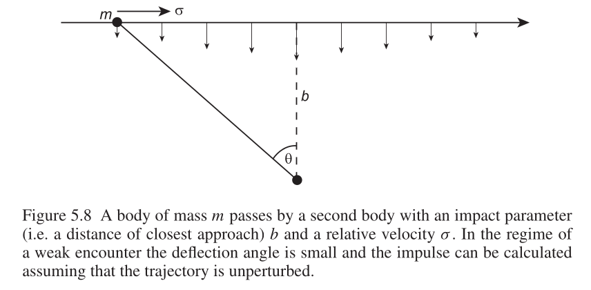
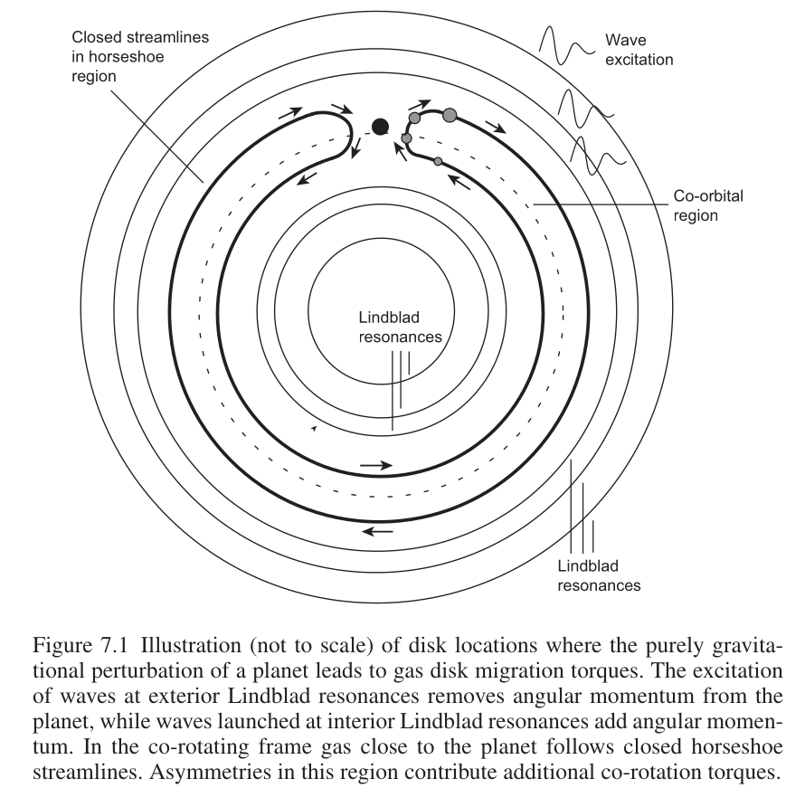
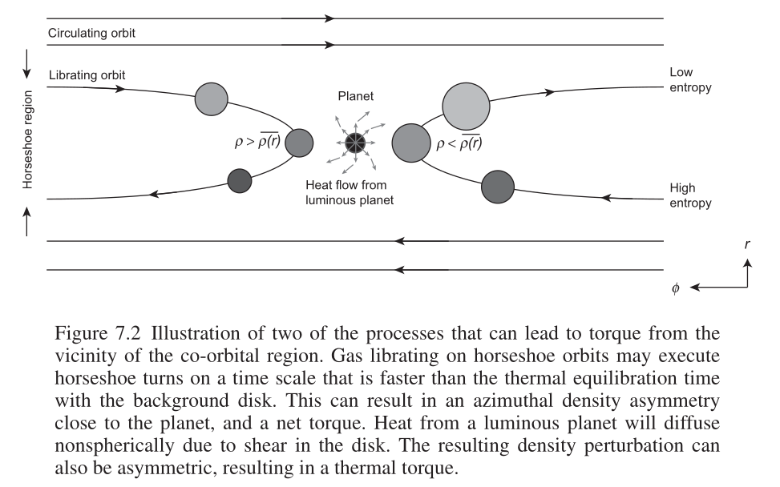

# Planet Formation

## 7 Early Evolution of Planetary Systems

### 7.1 Migration in Gaseous Disks

#### 7.1.1 Planet-Disk Torque in the Impulse Approximation

- our model:
  
  a planet and a gaseous disk orbiting a central object

- the key derivation:

  1. the change to the perpendicular velocity of the free particle in the gaseous disk that occurs during the encounter
  $$
  |\delta v_{\bot}|=\frac{2GM_p}{b\Delta v}\tag{7.1}
  $$
  ::: details derivation (Eq. 5.58)
  
  $$
  F_{\bot}=\frac{Gm^2}{d^2}\cos\theta\tag{5.56}
  $$
  $$
  F_\bot=\frac{Gm^2}{b^2}\left[1+\left(\frac{\sigma t}{b}\right)^2\right]^{-3/2}\tag{5.57}
  $$
  $$
  |\delta v_\bot|=\int_{-\infty}^\infty\frac{F_\bot}{m}\mathrm{d}t=\frac{2Gm}{b\sigma}\tag{5.58}
  $$
  :::

  2. considering the conservative kinetic energy of the gas particle, we can obtain the change of the parallel velocity
  $$
  \Delta v^2=|\delta v_\bot|^2+(\Delta v-\delta v_\parallel)^2\tag{7.2}
  $$
  $$
  \Rightarrow\delta v_\parallel\simeq\frac{1}{2\Delta v}\left(\frac{2GM_p}{b\Delta v}\right)^2\tag{7.3}
  $$

  3. denoting the semi-major axis $a$, the implied angular momentum change per unit mass of the gas is
  $$
  \Delta j=\frac{2G^2M_p^2a}{b^2\Delta v^3}\tag{7.4}
  $$

  4. calculate for the total torque due to its interactions with the gas outside the orbit:
  
  denoting the surface density of the gaseous disk $\Sigma$, the mass in the disk between $b$ and $b+\mathrm{d}b$ is
  $$
  \mathrm{d}m\approx2\pi a\Sigma\mathrm{d}b\tag{7.5}
  $$

  all of the gas within the annulus will encounter the planet in a time interval
  $$
  \Delta t=\frac{2\pi}{|\Omega-\Omega_p|}\tag{7.6}
  $$

  approximating $|\Omega-\Omega_p|$ as
  $$
  |\Omega-\Omega_p|\simeq\frac{3\Omega_p}{2a}b\tag{7.7}
  $$
  ::: details approximation
  in the Keplerian disk, the orbital angular velocity is
  $$
  \frac{GMm}{r^2}=m\omega^2r\Rightarrow \omega=\sqrt{GM}r^{-3/2}
  $$
  letting $r=a$, $\mathrm{d}r=b$, $\Omega_p=\sqrt{GM}a^{-3/2}$, yields
  $$
  \begin{align}
  |\Omega-\Omega_p|&=|\mathrm{d}\omega| \\
  &=\left|\sqrt{GM}\frac{-3}{2}r^{-5/2}\mathrm{d}r\right| \\
  &=\frac{3\sqrt{GM}}{2a^{5/2}}b \\
  &=\frac{3\Omega_p}{2a}b
  \end{align}
  $$
  :::

  the total torque is
  $$
  \frac{\mathrm{d}J}{\mathrm{d}t}=-\int_0^\infty\frac{\Delta j\mathrm{d}m}{\Delta t}=-\int_0^\infty\frac{8G^2M_p^2a\Sigma}{9\Omega_p^2}\frac{\mathrm{d}b}{b^4}\tag{7.8}
  $$
  $$
  \frac{\mathrm{d}J}{\mathrm{d}t}=-\frac{8}{27}\frac{G^2M_p^2a\Sigma}{\Omega_p^2b_{\text{min}}^3}\tag{7.9}
  $$

#### 7.1.2 Physics of Gas Disk Torques

the physical effects that can lead to migration torques:
- the impulse approximation
- at Lindblad resonances
- at co-orbital (corotation) resonances
- the thermal effects from the vicinity of the planet

