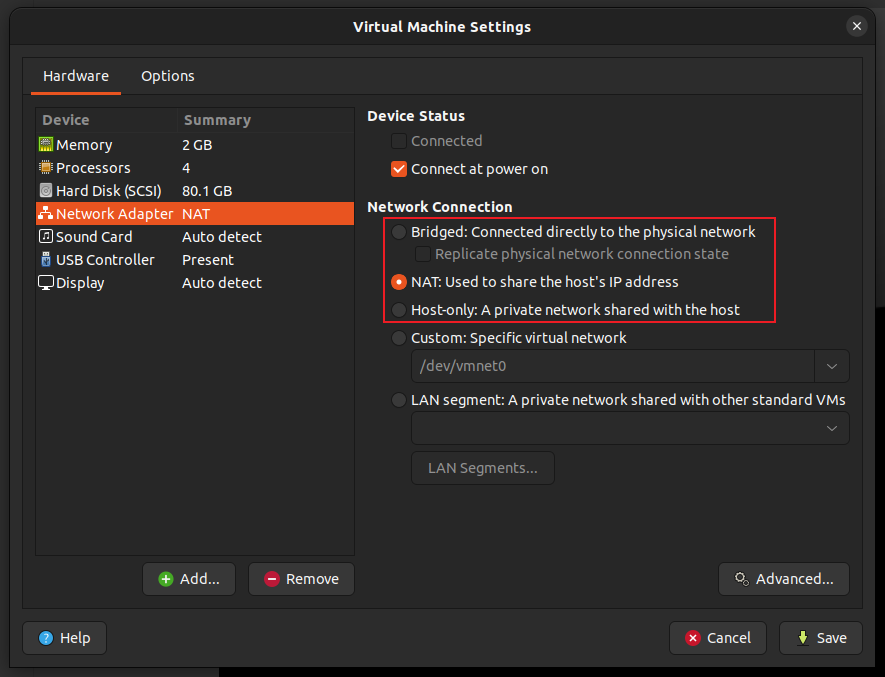
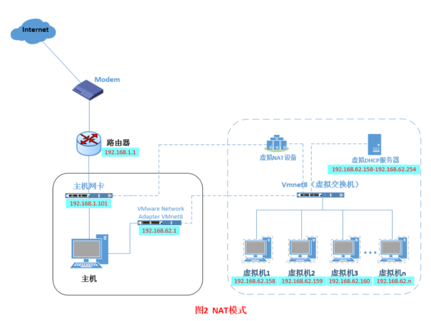

# linux 中 `ifconfig` 的输出

在终端使用 `ifconfig` 命令可以查看系统的网络配置，具体输出如下：
```sh
arwell@arwell-GL502VMZ:~$ ifconfig
enp4s0: flags=4099<UP,BROADCAST,MULTICAST>  mtu 1500
        ether 2c:4d:54:3c:bc:bb  txqueuelen 1000  (Ethernet)
        RX packets 0  bytes 0 (0.0 B)
        RX errors 0  dropped 0  overruns 0  frame 0
        TX packets 0  bytes 0 (0.0 B)
        TX errors 0  dropped 0 overruns 0  carrier 0  collisions 0

lo: flags=73<UP,LOOPBACK,RUNNING>  mtu 65536
        inet 127.0.0.1  netmask 255.0.0.0
        inet6 ::1  prefixlen 128  scopeid 0x10<host>
        loop  txqueuelen 1000  (Local Loopback)
        RX packets 24938  bytes 8126590 (8.1 MB)
        RX errors 0  dropped 0  overruns 0  frame 0
        TX packets 24938  bytes 8126590 (8.1 MB)
        TX errors 0  dropped 0 overruns 0  carrier 0  collisions 0

wlp3s0: flags=4163<UP,BROADCAST,RUNNING,MULTICAST>  mtu 1500
        inet 172.25.39.74  netmask 255.255.192.0  broadcast 172.25.63.255
        inet6 2001:da8:207:3002:9206:a045:6984:f4fe  prefixlen 64  scopeid 0x0<global>
        inet6 2001:da8:207:3002:f8dc:e3a1:2423:f9a1  prefixlen 64  scopeid 0x0<global>
        inet6 fe80::2d3a:3b18:fa71:9588  prefixlen 64  scopeid 0x20<link>
        ether f0:d5:bf:bc:da:5e  txqueuelen 1000  (Ethernet)
        RX packets 57561  bytes 29437718 (29.4 MB)
        RX errors 0  dropped 0  overruns 0  frame 0
        TX packets 41632  bytes 13260649 (13.2 MB)
        TX errors 0  dropped 0 overruns 0  carrier 0  collisions 0

virbr0: flags=4099<UP,BROADCAST,MULTICAST>  mtu 1500
        inet 192.168.122.1  netmask 255.255.255.0  broadcast 192.168.122.255
        ether 52:54:00:05:10:bc  txqueuelen 1000  (Ethernet)
        RX packets 0  bytes 0 (0.0 B)
        RX errors 0  dropped 0  overruns 0  frame 0
        TX packets 0  bytes 0 (0.0 B)
        TX errors 0  dropped 0 overruns 0  carrier 0  collisions 0

vmnet1: flags=4163<UP,BROADCAST,RUNNING,MULTICAST>  mtu 1500
        inet 192.168.168.1  netmask 255.255.255.0  broadcast 192.168.168.255
        inet6 fe80::250:56ff:fec0:1  prefixlen 64  scopeid 0x20<link>
        ether 00:50:56:c0:00:01  txqueuelen 1000  (Ethernet)
        RX packets 0  bytes 0 (0.0 B)
        RX errors 0  dropped 0  overruns 0  frame 0
        TX packets 839  bytes 0 (0.0 B)
        TX errors 0  dropped 0 overruns 0  carrier 0  collisions 0

vmnet8: flags=4163<UP,BROADCAST,RUNNING,MULTICAST>  mtu 1500
        inet 192.168.69.1  netmask 255.255.255.0  broadcast 192.168.69.255
        inet6 fe80::250:56ff:fec0:8  prefixlen 64  scopeid 0x20<link>
        ether 00:50:56:c0:00:08  txqueuelen 1000  (Ethernet)
        RX packets 0  bytes 0 (0.0 B)
        RX errors 0  dropped 0  overruns 0  frame 0
        TX packets 839  bytes 0 (0.0 B)
        TX errors 0  dropped 0 overruns 0  carrier 0  collisions 0
```

## 本机参数

其中前3项是计算机主机的网卡：

`enp4s0`: `en`表示`enternet`以太网

`lo`: `lo`表示`local`本地回环

`wlp3s0`: `wl`表示`wlan`(Wireless Local Area Network)无线局域网

`p?s?`是对应的PCI(外设部件互连标准 Peripheral Component Interconnect)接口的物理位置`(bus,slot)`，其中`bus`代表总线，`slot`代表插槽。

## VMware 虚拟机参数

后3项是VMware虚拟机软件的网络配置：

`virbr0`: 一个虚拟网桥/虚拟交换机，多个端口，同时连接主机和虚拟机，使主机和虚拟机处于相同地位。

`vmnet1`: 提供一个Host-Only的网络模式，只能访问主机。

`wmnet8`: 提供一个NAT方式。

对应的虚拟机网络设置如下图：



在使用NAT模式时主机与虚拟机的网络结构如下图：


