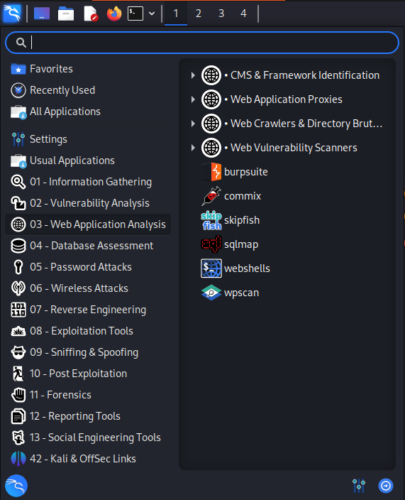

# 操作系统基础

## 操作系统简介

操作系统就是一个运行在物理设备（硬件）和应用软件之间的软件。

|操作系统类别|代表|
|:-------:|:---:|
|桌面操作系统|Windows(XP/10/11),macOS,Linux|
|服务器操作系统|Unix(AIX,HPUX),Linux,Windows Server|
|移动终端操作系统|Android,iOS,Windows Phone(WP)|
|嵌入式操作系统|FreeRTOS,Unison,eCos,NXPMQX|
|物联网操作系统|Android Things,ALiOS,ARM Mbed OS,Lite OS|
|云操作系统|Windows,CentOS,Ubuntu|

## Windows系统

常用的`cmd`命令：

|命令|用途|
|:--:|:--:|
|`cd`|切换目录|
|`dir`|查看目录文件|
|`md`|创建文件夹|
|`rm`|删除文件夹|
|`ipconfig`|查看本机ip|
|`cls`|清屏|
|`copy <file> <new\path\to\file>`|复制文件|
|`move <file> <new\path\to\file>`|移动文件|
|`del <file>`|删除文件|
|`ping <ip>`|测试网络连接|
|`netstat <options>`|查看网络端口|
|`systeminfo`|查看系统信息|
| | |
|`whoami`|查看当前用户|
|`net user`|查看系统用户|
|`net user <user-name>`|查看用户信息|
|`net user <user-name> *`|修改用户密码|
|`net user <user-name> <user-pwd> /add`|添加用户|
|`net localgroup administrators`|查看管理员用户|
|`net localgroup administrators <user-name> /add`|将用户添加为管理员用户|

::: info 管道
`<command1> | <command2>`将第一个命令的输出作为第二个命令的输入

`<command> >> <output-file> << <input-file>` 重定向输入输出为文件
:::

## Linux系统

常用的终端命令：

|命令|用途|
|:---:|:---:|
|`cd`|切换目录|
|`ls`|查看目录文件|
|`mkdir`|创建文件夹|
|`rmdir`|删除文件夹|
|`ifconfig`|查看ip|
|`cp <file> <new/path/to/file>`|复制文件|
|`mv <file> <new/path/to/file>`|移动文件|
|`rm <file>`|删除文件|
|`ping <ip>`|测试网络连接|

::: info 命令使用
Linux的终端命令可以通过`man <command>`或者`<command> -h/--help`来查看使用方式。
:::

kali-Linux操作系统集成了很多工具，比如网络抓包的BurpSuite，扫描网段的`nmap`，渗透工具`msfconsole`等。

## 操作系统安全

系统入侵排查参考：[应急响应之Windows/Linux(入侵排查篇)](https://blog.csdn.net/weixin_46944519/article/details/121466490)

系统加固参考：[Windows安全加固总结（非常详细）零基础入门到精通，收藏这一篇就够了](https://blog.csdn.net/Python_0011/article/details/139079448)

[linux安全加固（非常详细）零基础入门到精通，收藏这一篇就够了](https://blog.csdn.net/leah126/article/details/139354979)
