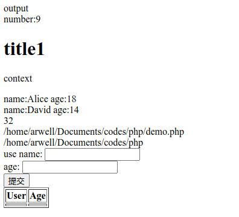
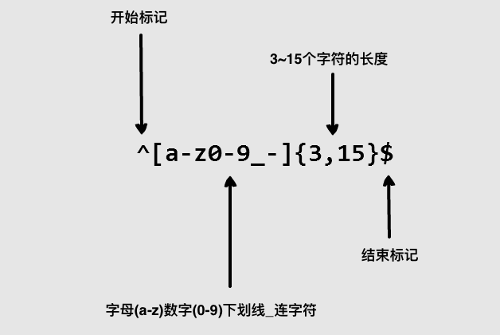

# php编程基础

详见[菜鸟教程php](https://www.runoob.com/php/php-tutorial.html)，下面举例部分用法。

## php基础语法和表单操作

```php
<!DOCTYPE html>
<html>
<body>

<?php
echo 'output<br>';
// 变量
$x = 3;
$y = 6;
$txt = 'number:';
$z = $x + $y;
echo $txt.$z.'<br>';
// 多行字符串变量
$txt = <<<EOF
    <h1>title1</h1>
    <p>context</p>
EOF;
echo $txt;
// 数组
$name = array('Alice','Bob','David');
$age = array(18,21,14);
// if & for
for($i = 0; $i < 3; $i++){
    if ($age[$i] < 20){
        echo 'name:'.$name[$i].' age:'.$age[$i].'<br>';
    }
}
// 函数
function print_var($var){
    echo $var.'<br>';
}
print_var(__LINE__);
print_var(__FILE__);
print_var(__DIR__);
?>
<!-- 表单处理 -->
<form action="" method="post">
    <label for="name">user name:</label>
    <input type="text" id="name" name="name" required>
    <br>
    <label for="age">age:</label>
    <input type="number" id="age" name="age" required>
    <br>
    <input type="submit" value="提交">
</form>

<table border='1'>
    <thead>
        <tr>
            <th>User</th>
            <th>Age</th>
        </tr>
    </thead>
    <hbody>
        <tr>
            <th><?php echo $_POST['name']; ?></th>
            <th><?php echo $_POST['age']; ?></th>
        </tr>
    </hbody>
</table>

</body>
</html>
```

效果如下：


## php验证登录

在同一目录创建三个`.php`文件，内容分别如下：

`index.php`
```php
<?php
// 启用会话，方便存储登录状态
session_start();

// 设置预定义的账号和密码
$valid_username = "admin";
$valid_password = "pwd";

// 初始化错误信息
$error_message = "";

// 检查表单提交
if ($_SERVER['REQUEST_METHOD'] == 'POST') {
    // 获取用户输入的用户名和密码
    $username = $_POST['username'];
    $password = $_POST['password'];

    // 验证用户名和密码
    if ($username == $valid_username && $password == $valid_password) {
        // 如果输入正确，设置会话标记为已登录
        $_SESSION['logged_in'] = true;
        // 跳转到欢迎页面
        header("Location: welcome.php");
        exit();
    } else {
        // 如果账号或密码错误，显示错误信息
        $error_message = "用户名或密码错误，请重试。";
    }
}
?>

<!DOCTYPE html>
<html lang="zh-CN">
<head>
    <meta charset="UTF-8">
    <meta name="viewport" content="width=device-width, initial-scale=1.0">
    <title>登录页面</title>
</head>
<body>
    <h2>登录</h2>

    <!-- 显示错误信息 -->
    <?php if ($error_message): ?>
        <p style="color: red;"><?php echo $error_message; ?></p>
    <?php endif; ?>

    <!-- 登录表单 -->
    <form method="POST" action="index.php">
        <label for="username">用户名:</label>
        <input type="text" id="username" name="username" required><br><br>

        <label for="password">密码:</label>
        <input type="password" id="password" name="password" required><br><br>

        <input type="submit" value="登录">
    </form>
</body>
</html>
```

`welcome.php`
```php
<?php
// 启用会话，检查用户是否已登录
session_start();

// 如果没有登录，重定向到登录页面
if (!isset($_SESSION['logged_in']) || !$_SESSION['logged_in']) {
    header("Location: index.php");
    exit();
}
?>

<!DOCTYPE html>
<html lang="zh-CN">
<head>
    <meta charset="UTF-8">
    <meta name="viewport" content="width=device-width, initial-scale=1.0">
    <title>欢迎页面</title>
</head>
<body>
    <h2>欢迎来到主页！</h2>
    <p>您已成功登录。</p>

    <!-- 添加退出登录链接 -->
    <a href="logout.php">退出登录</a>
</body>
</html>
```

`logout.php`
```php
<?php
// 启用会话，销毁会话以登出
session_start();
session_destroy();

// 重定向回登录页面
header("Location: index.php");
exit();
?>
```

如果没有在`index.php`页面输入正确的账号密码，直接在浏览器地址栏输入`welcome.php`的URL地址会直接重定向回`index.php`，只有登录之后才能访问。

## php数据库操作

1. 创建数据表
```php
<?php
$servername = "localhost";
$username = "username";
$password = "password";
$dbname = "myDB";
 
// 创建连接
$conn = new mysqli($servername, $username, $password, $dbname);
// 检测连接
if ($conn->connect_error) {
    die("连接失败: " . $conn->connect_error);
} 
 
// 使用 sql 创建数据表
$sql = "CREATE TABLE MyGuests (
id INT(6) UNSIGNED AUTO_INCREMENT PRIMARY KEY, 
firstname VARCHAR(30) NOT NULL,
lastname VARCHAR(30) NOT NULL,
email VARCHAR(50),
reg_date TIMESTAMP
)";
 
if ($conn->query($sql) === TRUE) {
    echo "Table MyGuests created successfully";
} else {
    echo "创建数据表错误: " . $conn->error;
}
 
$conn->close();
?>
```

2. 向表内插入记录
```php
<?php
$servername = "localhost";
$username = "username";
$password = "password";
$dbname = "myDB";
 
// 创建连接
$conn = new mysqli($servername, $username, $password, $dbname);
// 检测连接
if ($conn->connect_error) {
    die("连接失败: " . $conn->connect_error);
} 
 
$sql = "INSERT INTO MyGuests (firstname, lastname, email)
VALUES ('John', 'Doe', 'john@example.com')";
 
if ($conn->query($sql) === TRUE) {
    echo "新记录插入成功";
} else {
    echo "Error: " . $sql . "<br>" . $conn->error;
}

$conn->close();
?>
```

3. 从表中读取数据
```php
<?php
$servername = "localhost";
$username = "username";
$password = "password";
$dbname = "myDB";
 
// 创建连接
$conn = new mysqli($servername, $username, $password, $dbname);
// Check connection
if ($conn->connect_error) {
    die("连接失败: " . $conn->connect_error);
} 
 
$sql = "SELECT id, firstname, lastname FROM MyGuests";
$result = $conn->query($sql);
 
if ($result->num_rows > 0) {
    // 输出数据
    while($row = $result->fetch_assoc()) {
        echo "id: " . $row["id"]. " - Name: " . $row["firstname"]. " " . $row["lastname"]. "<br>";
    }
} else {
    echo "0 结果";
}
$conn->close();
?>
```

## 正则表达式

正则表达式是用来匹配字符串的，比如用`*.txt`代表所有后缀名为`txt`的文件名。

详见[菜鸟教程-正则表达式](https://www.runoob.com/regexp/regexp-tutorial.html)



