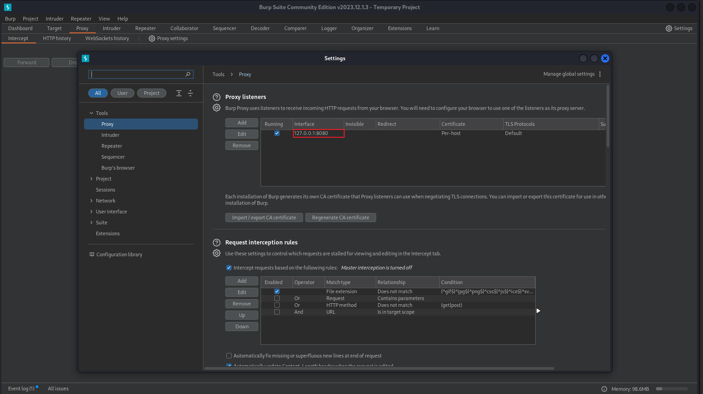

# Web基础

## Web前端基础

网络通信协议(HTTP,HTTPS,WS)和安全协议(SSL,TLS,XTLS)，详见[常见网络通信协议（http、https、ws）及安全协议(SSL、TLS、XTLS)](https://blog.csdn.net/weixin_43764974/article/details/132637211)

http协议状态码：

常见的状态码：

|状态码|含义|
|:---:|:---:|
|`200 OK`|请求成功|
|`301 Moved Permanently`|资源已经永久移动到新位置，返回新的URL|
|`302 Found`|资源临时移动到新位置，返回新的URL|
|`304 Not Modified`|资源未修改，可以直接使用缓存版本|
|`400 Bad Request`|请求格式错误，服务器无法解析|
|`401 Unauthorized`|请求需要用户身份认证|
|`403 Forbidden`|服务器拒绝请求，用户权限不足|
|`404 Not Found`|请求资源不存在，URL错误|
|`500 Internal Server Error`|服务器内部错误，无法完成请求|
|`503 Service Unavailable`|服务器暂时不可用，过载或维护|

完整的[HTTP Status Codes Cheat Sheet](https://javaconceptoftheday.com/http-status-codes-cheat-sheet/)

html、css、javascript是实现网页的语言，[html](https://www.runoob.com/html/html-tutorial.html)处理网页内容，[css](https://www.runoob.com/css/css-tutorial.html)处理网页排版，[javascript](https://www.runoob.com/js/js-tutorial.html)对用户操作进行响应。细节可以在[菜鸟教程](https://www.runoob.com/)查看，大致了解其语法即可。

## Web安全

### OWASP Top 10

[OWASP](https://owasp.org/www-project-top-ten/)（开放式Web应用程序安全项目）是一个开放社区，其“10项最严重的Web应用程序安全风险列表”总结并更新Web应用程序中最可能、最常见、最危险的十大漏洞。

1. 注入漏洞

攻击方式：通过恶意字符串将恶意代码写入数据库，获取敏感数据或进一步执行命令。

漏洞原因：未审计的数据输入、使用网址直接传递变量、未过滤的特殊字符、SQL错误回显

例子：SQL注入，后端开发人员经常会拼接SQL查询，例如SQL语句
`select * from users where pwd='input_str'`
当输入恶意字符串`' or 1=1 --'`后，上面语句变成了`select * from users where pwd='' or 1=1 --''`，会返回所有的`users`信息。

::: info 例题
[[极客大挑战 2019]EasySQL1](https://buuoj.cn/challenges#[%E6%9E%81%E5%AE%A2%E5%A4%A7%E6%8C%91%E6%88%98%202019]EasySQL)
:::

防护：关闭SQL错误回显、前端对输入字符验证、SQL操作使用PreParedStatement、SQL服务运行于专门的账号并使用最小权限、限制SQL服务的远程访问、代码审计、使用成熟的WAF

2. 失效的身份认证

攻击方式：攻击者利用网址应用程序中的身份认证缺陷获取高权限并进行攻击应用服务。

漏洞原因：应用程序身份认证系统认证缺陷

攻击方式：网站设计不良，可以直接绕过验证页面、使用者忘记注销，攻击者有机可乘、弱密码

防护：网站登录页面使用加密连接、良好的权限控制与管理、超时注销机制

3. 敏感数据泄露

攻击方式：常见的攻击方式主要是扫描应用程序获取到敏感数据

漏洞原因：开发人员无意间上传敏感数据，如github文件泄露、敏感数据文件权限设置错误，如数据库备份文件泄露、网络协议，算法的弱点，如telent,ftp,md5等

防护：对于github泄露，定期扫描仓库、对应用网站目录定期扫描、使用强壮的网络协议与算法

4. XML外部实体漏洞
5. 无效的访问控制
6. 安全配置错误
7. 跨站脚本攻击
8. 不安全的反序列化漏洞
9. 使用含有已知漏洞的组件
10. 日志记录和监控不足的风险

参考[owasp top10 | 十大常见漏洞详解](https://blog.csdn.net/m0_73826804/article/details/136226960)

### Web漏洞扫描工具

上网查一下就有了。

### Web渗透工具`nmap`

[`kali tool nmap`](https://www.kali.org/tools/nmap/)或者`nmap -h`

### Web渗透工具BurpSuite

抓包工具，可以在`Proxy`模块抓取http数据包。

使用前要设置浏览器代理。

### Web渗透工具`sqlmap`

[`kali tool sqlmap`](https://www.kali.org/tools/sqlmap/)或者`sqlmap -h`
