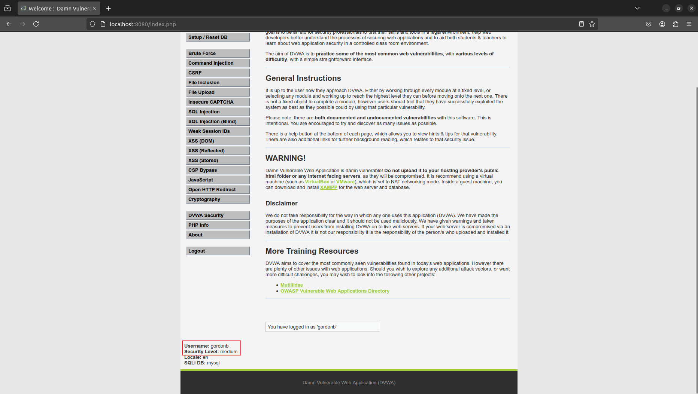

# CSRF漏洞

写的很详细的一篇文章：[CSRF入门及靶场实战](https://www.freebuf.com/articles/web/341591.html)

## CSRF漏洞利用

### CSRF简介

CSRF(Cross-Site Request Forgery)跨站请求伪造，也称为One Click Attack或者Session Riding。听起来像跨站脚本(XSS)但是二者并不同，XSS是利用站点内的信任用户，而CSRF则通过伪装成受信任用户请求受信任的网站。

### CSRF攻击原理和类型

原理如下图：


类型根据伪造的请求的类型分为GET和POST两种，如下：

- ``

- 
```html
<html>
    <head>
        <script type="text/javascript">
            function steal()
            {
                iframe = document.frames["steal"];
                iframe.document.Submit("transfer");
            }
        </script>
    </head>

    <body onload="steal()">
        <iframe name="steal" display="none">
            <form method="POST" name="transfer"　action="http://www.myBank.com/Transfer.php">
                <input type="hidden" name="toBankId" value="11">
                <input type="hidden" name="money" value="1000">
            </form>
        </iframe>
    </body>
</html>
```

参考：[浅谈CSRF攻击方式](https://www.cnblogs.com/hyddd/archive/2009/04/09/1432744.html)

## CSRF实例与进阶

### CSRF例子

以靶场[DVWA](https://github.com/digininja/DVWA/blob/master/README.zh.md)为例。

这里仅记录一种情况，具体可以查看参考资料。

**medium level**

先模拟受害者登录DVWA，然后设置安全系数为medium。



当受害者gordonb在登录了DVWA的情况下，引诱其访问构造的`hack.html`文件如下：

```html
<!DOCTYPE html>
<html>
<head>
	<title></title>
</head>
<body>


</body>
</html>
```

则其密码就会被改成上面url中的密码。

level high 增加了`user_token`验证。

由于现在浏览器不允许跨站解析，所以无法直接通过构造一个html页面来盗取其`user_token`除非能把恶意网页部署在与网址同一个服务器上。网上许多博客采用借用XSS漏洞来盗取`user_token`的方式 $^{[1]}$ ，但是在实际上也很难做到，只能说理论上可行。还有做法是利用BurpSuite的CSRF Token Tracker绕过验证插件 $^{[2],[3]}$ 。

参考：
- [1] [\[超详细DVWA-CSRF全等级通关教程\]都是干货，你确定不看看？](https://cloud.tencent.com/developer/article/1825357)
- [2] [DVWA-CSRF全通关（图文详解+源码解析）](https://blog.csdn.net/weixin_46709219/article/details/109325123)
- [3] [DVWA 靶场 CSRF 通关解析](https://blog.csdn.net/2302_82189125/article/details/138537008)

### CSRF防护绕过

1. Referer绕过：

（1）空referer绕过

（2）包含referer：若只检查是否包含网址，可以新建一个以网址为名的文件、文件夹

2. CSRF-token绕过：

（1）删除令牌：删除cookie/参数中的token，免服务器验证

（2）令牌共享：创建两个账户，替换token看是否可以互相共用

（3）篡改令牌值：有时服务器只检查令牌的长度

（4）解码令牌：尝试进行md5或Base64编码

（5）修改请求方法：post改为get

（6）窃取token：重定向、XSS、web缓存欺骗、clickjacking等都有可能会导致token泄露。

参考：[跨站请求伪造（CSRF）挖掘技巧及实战案例全汇总](https://cloud.tencent.com/developer/article/1516424)
