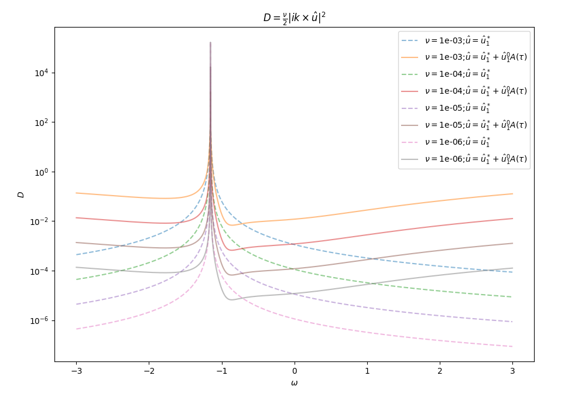
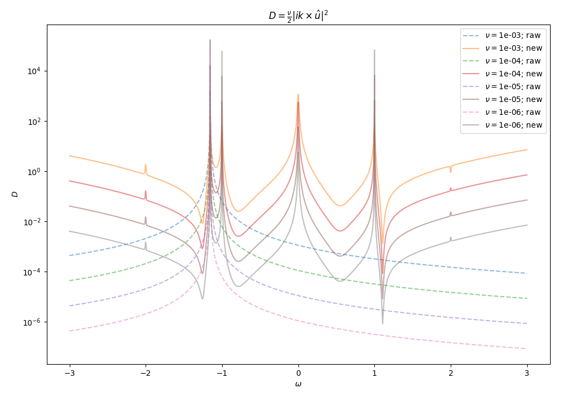

# 25-5-27

## 关于非线性项 $\mathcal{N}(u,u)$

我发现要想引入非线性项，必须舍弃不可压缩流体的条件 $(\nabla\boldsymbol{u}=0\Leftrightarrow\boldsymbol{k}\cdot\hat{\boldsymbol{u}}_n=0)$

原因：
若取速度场解的形式为 $\boldsymbol{u}=\mathrm{Re}\{\hat{\boldsymbol{u}}_n\mathrm{e}^{in(\boldsymbol{k}\cdot\boldsymbol{x}-\omega t)}\}=\hat{\boldsymbol{u}}_n\cos[n(\boldsymbol{k}\cdot\boldsymbol{x}-\omega t)]$
则非线性项 
$$
\begin{align}
\boldsymbol{u}_n\cdot\nabla\boldsymbol{u}_m &=\left(u_{nx}\frac{\partial}{\partial x}+u_{ny}\frac{\partial}{\partial y}+u_{nz}\frac{\partial}{\partial z}\right)\left\{\boldsymbol{\hat{u}}_m\cos[m(\boldsymbol{k}\cdot\boldsymbol{x}-\omega t)]\right\} \notag\\
&=-\left(u_{nx}mk_x\hat{\boldsymbol{u}}_m+u_{ny}mk_y\hat{\boldsymbol{u}}_m+u_{nz}mk_z\hat{\boldsymbol{u}}_m\right)\sin[m(\boldsymbol{k}\cdot\boldsymbol{x}-\omega t)] \notag\\
&=-m\underbrace{(\hat{\boldsymbol{u}}_n\cdot\boldsymbol{k})}_{\boldsymbol{k}\cdot\hat{\boldsymbol{u}}_n=0}\hat{\boldsymbol{u}}_m\cos[n(\boldsymbol{k}\cdot\boldsymbol{x}-\omega t)]\sin[m(\boldsymbol{k}\cdot\boldsymbol{x}-\omega t)] \notag
\end{align}
$$

对任意频率 $(n\boldsymbol{k},n\omega),(m\boldsymbol{k},m\omega)$ 都有 $\boldsymbol{u}_n\cdot\nabla\boldsymbol{u}_m=0$

## 线性部分

由于舍弃条件 $\boldsymbol{k}\cdot\hat{\boldsymbol{u}}_n=0$ ，而原线性部分方程解法使用了该条件，需要重新求解：
$$
\frac{\partial \boldsymbol{u}_1}{\partial t}=-\frac{1}{\rho\varepsilon}\nabla p+\nu\nabla^2\boldsymbol{u}_1+2\boldsymbol{u}_1\times\boldsymbol{\Omega}+\frac{\boldsymbol{f}}{\varepsilon}
$$

### 求解

前面步骤一致，通过 $i\boldsymbol{k}\times$ 操作消去变量 $\hat{p}$ 得到方程：
$$
(\omega+i\nu k^2)\boldsymbol{k}\times\hat{\boldsymbol{u}}_1=2i(\boldsymbol{k}\cdot\boldsymbol{\Omega})\hat{\boldsymbol{u}}_1-\underbrace{2i(\boldsymbol{k}\cdot\hat{\boldsymbol{u}}_1)\boldsymbol{\Omega}}_{\text{new term}}+\frac{k\hat{f}}{\varepsilon}
$$

写出分量形式：
$$
\left\{\begin{array}{rrrlc}
-2ik_z\Omega\hat{u}_{1x} & -(\omega+i\nu k^2)k_z\hat{u}_{1y} & +(\omega+i\nu k^2)k_y\hat{u}_{1z} & =\dfrac{k\hat{f}_x}{\varepsilon} & (1)\\
(\omega+i\nu k^2)k_z\hat{u}_{1x} & -2ik_z\Omega\hat{u}_{1y} & -(\omega+i\nu k^2)k_x\hat{u}_{1z} & =\dfrac{k\hat{f}_y}{\varepsilon} & (2)\\
[2i\Omega k_x-(\omega+i\nu k^2)k_y]\hat{u}_{1x} & +[2i\Omega k_y+(\omega+i\nu k^2)k_x]\hat{u}_{1y} & +0\hat{u}_{1z} & =\dfrac{k\hat{f}_z}{\varepsilon} & (3)
\end{array}\right.
$$

该非齐次线性方程组中式 $(1)(2)$ 蕴含了式 $(3)$
系数矩阵的秩为 $2$ 即解空间 $\hat{\boldsymbol{u}}_1$ 的维数为 $1$
记特解为 $\hat{\boldsymbol{u}}_1^*$ 通解为 $\hat{\boldsymbol{u}}_1^0$
容易验证 
$$
\hat{\boldsymbol{u}}_1^*=\frac{ik\hat{\boldsymbol{f}}}{k(\omega+i\nu k^2)+2k_z\Omega}\frac{1}{\varepsilon}
$$

是方程组的特解，求解对应的齐次方程得到通解
$$
\hat{\boldsymbol{u}}_1^0=\left[\begin{array}{c}
(\omega+i\nu k^2)^2k_x+2i\Omega(\omega+i\nu k^2)k_y \\
-2i\Omega(\omega+i\nu k^2)k_x+(\omega+i\nu k^2)^2k_y \\
((\omega+i\nu k^2)^2-4\Omega^2)k_z
\end{array}\right]
$$

故
$$
\hat{\boldsymbol{u}}_1=\hat{\boldsymbol{u}}_1^*+\hat{\boldsymbol{u}}_1^0A(\tau)
$$

### 耗散

将 $\hat{\boldsymbol{u}}=\varepsilon\hat{\boldsymbol{u}}_1=\varepsilon(\hat{\boldsymbol{u}}_1^*+\hat{\boldsymbol{u}}_1^0A(\tau))$ 代入耗散
$$
D=\nu\frac{1}{V}\int_V|\nabla\times\boldsymbol{u}|^2\mathrm{d}V=\frac{\nu}{2}|i\boldsymbol{k}\times\varepsilon(\hat{\boldsymbol{u}}_1^*+\hat{\boldsymbol{u}}_1^0)|^2
$$

使用与论文 Linear and nonlinear responses to harmonic force in rotating flow 中 Figure 1 相同的参数，额外参数 $A(\tau)=1$ ，得到 $\nu=10^{-3},10^{-4},10^{-5},10^{-6}$ 时的耗散：



（图中虚线代表原论文中曲线，实线代表修正后曲线）

## 二阶部分

### 求解

方程
$$
\frac{\partial \boldsymbol{u}_2}{\partial t}+\underbrace{\partial_\tau\boldsymbol{u}_1}_{(\boldsymbol{k},\omega)}+\underbrace{\boldsymbol{u}_1\cdot\nabla\boldsymbol{u}_1}_{(2\boldsymbol{k},2\omega)}=\nu\nabla^2\boldsymbol{u}_2+2\boldsymbol{u}_2\times\boldsymbol{\Omega}
$$

其中
$$
\partial_\tau\boldsymbol{u}_1=\partial_\tau(\hat{\boldsymbol{u}}_1^*+\hat{\boldsymbol{u}}_1^0A(\tau))\cos(\boldsymbol{k}\cdot\boldsymbol{x}-\omega t)=\hat{\boldsymbol{u}}_1^0A'(\tau)\cos(\boldsymbol{k}\cdot\boldsymbol{x}-\omega t)
$$

$$
\begin{align}
\boldsymbol{u}_1\cdot\nabla\boldsymbol{u}_1&=-(\boldsymbol{k}\cdot\hat{\boldsymbol{u}}_1)\hat{\boldsymbol{u}}_1\cos(\boldsymbol{k}\cdot\boldsymbol{x}-\omega t)\sin(\boldsymbol{k}\cdot\boldsymbol{x}-\omega t) \notag\\
&=-\frac{\boldsymbol{k}\cdot\hat{\boldsymbol{u}}_1}{2}\hat{\boldsymbol{u}}_1\sin[2(\boldsymbol{k}\cdot\boldsymbol{x}-\omega t)] \notag\\
&=\mathrm{Re}\left\{\frac{i}{2}(\boldsymbol{k}\cdot\hat{\boldsymbol{u}}_1)\hat{\boldsymbol{u}}_1\mathrm{e}^{i2(\boldsymbol{k}\cdot\boldsymbol{x}-\omega t)}\right\} \notag
\end{align}
$$

假设方程的解分解为 $\boldsymbol{u}_2=\boldsymbol{u}_{2a}+\boldsymbol{u}_{2b}$ 分别对应频率 $(\boldsymbol{k},\omega),(2\boldsymbol{k},2\omega)$
则方程分解为
$$
\left\{\begin{array}{l}
\displaystyle\frac{\partial\boldsymbol{u}_{2a}}{\partial t}+\partial_\tau\boldsymbol{u}_1=\nu\nabla^2\boldsymbol{u}_{2a}+2\boldsymbol{u}_{2a}\times\boldsymbol{\Omega} \\
\displaystyle\frac{\partial\boldsymbol{u}_{2b}}{\partial t}+\boldsymbol{u}_1\cdot\nabla\boldsymbol{u}_1=\nu\nabla^2\boldsymbol{u}_{2b}+2\boldsymbol{u}_{2b}\times\boldsymbol{\Omega}
\end{array}\right.
$$

猜测解 $\boldsymbol{u}_{2a}=\mathrm{Re}\{\hat{\boldsymbol{u}}_{2a}\mathrm{e}^{i(\boldsymbol{k}\cdot\boldsymbol{x}-\omega t)}\},$ $\boldsymbol{u}_{2b}=\mathrm{Re}\{\hat{\boldsymbol{u}}_{2b}\mathrm{e}^{i2(\boldsymbol{k}\cdot\boldsymbol{x}-\omega t)}\}$

$$
\left\{\begin{array}{lr}
-i\omega\hat{\boldsymbol{u}}_{2a}+\hat{\boldsymbol{u}}_1^0A'(\tau)=-\nu k^2\hat{\boldsymbol{u}}_{2a}+2\hat{\boldsymbol{u}}_{2a}\times\boldsymbol{\Omega} & (2a) \\
\displaystyle-i2\omega\hat{\boldsymbol{u}}_{2b}+\frac{i}{2}(\boldsymbol{k}\cdot\hat{\boldsymbol{u}}_1)\hat{\boldsymbol{u}}_1=-\nu 4k^2\hat{\boldsymbol{u}}_{2b}+2\hat{\boldsymbol{u}}_{2b}\times\boldsymbol{\Omega} & (2b)
\end{array}\right.
$$

分别写成分量形式求解非齐次线性方程组得到
$$
\hat{\boldsymbol{u}}_{2a}=\frac{A'(\tau)}{i}\left[\begin{array}{c}
\displaystyle\frac{(\omega+i\nu k^2)\hat{u}_{1x}^0+2i\Omega\hat{u}_{1y}^0}{(\omega+i\nu k^2)^2-4\Omega^2} \\
\displaystyle\frac{-2i\Omega\hat{u}_{1x}^0+(\omega+i\nu k^2)\hat{u}_{1y}^0}{(\omega+i\nu k^2)^2-4\Omega^2} \\
\displaystyle\frac{(\omega+i\nu k^2)^2-4\Omega^2}{\omega+i\nu k^2}\hat{u}_{1z}^0
\end{array}\right]
$$

$$
\hat{\boldsymbol{u}}_{2b}=\frac{(\boldsymbol{k}\cdot\hat{\boldsymbol{u}}_1)}{2}\left[\begin{array}{c}
\displaystyle\frac{(2\omega+4i\nu k^2)\hat{u}_{1x}+2i\Omega\hat{u}_{1y}}{(2\omega+4i\nu k^2)^2-4\Omega^2} \\
\displaystyle\frac{-2i\Omega\hat{u}_{1x}+(2\omega+4i\nu k^2)\hat{u}_{1y}}{(2\omega+4i\nu k^2)^2-4\Omega^2} \\
\displaystyle\frac{\hat{u}_{1z}}{2\omega+4i\nu k^2}
\end{array}\right]
$$

### 耗散

现在 $\hat{\boldsymbol{u}}=\varepsilon(\hat{\boldsymbol{u}}_1^*+\hat{\boldsymbol{u}}_1^0A(\tau))+\varepsilon^2(\hat{\boldsymbol{u}}_{2a}+\hat{\boldsymbol{u}}_{2b})$ 耗散为
$$
D=\nu\frac{1}{V}\int_V|\nabla\times\boldsymbol{u}|^2\mathrm{d}V=\frac{\nu}{2}|i\boldsymbol{k}\times[\varepsilon(\hat{\boldsymbol{u}}_1^*+\hat{\boldsymbol{u}}_1^0A(\tau))+\varepsilon^2\hat{\boldsymbol{u}}_{2a}]+i2\boldsymbol{k}\times\varepsilon^2\hat{\boldsymbol{u}}_{2b}|^2
$$

所使用的参数同上，额外参数 $A'(\tau)=0.01$ ，得到耗散如下：



与预期的结果差异较大：
1. 在原共振峰处没有压缩；
2. 出现多处新共振峰

可能原因：
1. 展开到 $\hat{\boldsymbol{u}}_2$ 不够？
2. 参数 $A(\tau),A'(\tau)$ 的问题？

## 附录

绘图所编写的 `python` 代码

1. `linear.py`
```py
import numpy as np
import matplotlib.pyplot as plt

# define arguments
a = 1
k = np.array([1, 1, 1])
Omega = 1
# nvs = [1e-3]
nvs = [1e-3, 1e-4, 1e-5, 1e-6]
k_abs = np.sqrt(k @ k)
fx_abs = np.sqrt(k[1]**2+k[2]**2)*a/(np.sqrt(2)*k_abs)
fx = fx_abs
fy = (-k[0]*k[1]+1j*k_abs*k[2])*fx/(k[1]**2+k[2]**2)
fz = (-k[1]*k[2]+1j*k_abs*k[0])*fy/(k[0]**2+k[2]**2)
f = np.array([fx, fy, fz])
epsilon = np.sqrt(np.abs(f) @ np.abs(f))
A_tau = 1

# generate w range [-3, 3] and add w0
w = np.linspace(-3, 3, 1000)
w0 = -2 / np.sqrt(3)
w = np.sort(np.append(w, w0))

# only u1_star
def d1(w, nv):
    x = 2 * k[2] * Omega + k_abs * (w + 1j * nv * k_abs**2)
    x = np.abs(x)**2
    d = 1/x
    d = d * nv * a**2 * k_abs**4 / 2
    return d

# u1_star with u1_base
def d2(w, nv):
    u1_star0 = 1j*k_abs*f[0]/(k_abs*(w+1j*nv*k_abs**2)+2*k[2]*Omega*epsilon)
    u1_star1 = 1j*k_abs*f[1]/(k_abs*(w+1j*nv*k_abs**2)+2*k[2]*Omega*epsilon)
    u1_star2 = 1j*k_abs*f[2]/(k_abs*(w+1j*nv*k_abs**2)+2*k[2]*Omega*epsilon)
    u1_base0 = (w+1j*nv*k_abs**2)**2*k[0]+2j*Omega*(w+1j*nv*k_abs**2)*k[1]
    u1_base1 = -2j*Omega*(w+1j*nv*k_abs**2)*k[0]+(w+1j*nv*k_abs**2)**2*k[1]
    u1_base2 = ((w+1j*nv*k_abs**2)**2-4*Omega**2)*k[2]
    u_0 = epsilon * (u1_star0 + u1_base0 * A_tau)
    u_1 = epsilon * (u1_star1 + u1_base1 * A_tau)
    u_2 = epsilon * (u1_star2 + u1_base2 * A_tau)
    dx = k[1] * u_2 - k[2] * u_1
    dy = k[2] * u_0 - k[0] * u_2
    dz = k[0] * u_1 - k[1] * u_0
    d = (np.abs(dx)**2 + np.abs(dy)**2 + np.abs(dz)**2) * nv / 2
    return d

for nv in nvs:
    y1 = d1(w, nv)
    y2 = d2(w, nv)
    plt.semilogy(w, y1, '--', alpha=0.5, label=r'$\nu=$' + f'{nv:.0e}' + r';$\hat{u}=\hat{u}_1^*$')
    plt.semilogy(w, y2, alpha=0.5, label=r'$\nu=$' + f'{nv:.0e}' + r';$\hat{u}=\hat{u}_1^*+\hat{u}_1^0A(\tau)$')
plt.title(r'$D=\frac{\nu}{2}|ik\times\hat{u}|^2$')
plt.xlabel(r'$\omega$')
plt.ylabel(r'$D$')
plt.legend()
plt.show()
```

2. `nonlinear.py`
```py
import numpy as np
import matplotlib.pyplot as plt

# define arguments
a = 1
k = np.array([1, 1, 1])
Omega = 1
# nvs = [1e-3]
nvs = [1e-3, 1e-4, 1e-5, 1e-6]
k_abs = np.sqrt(k @ k)
fx_abs = np.sqrt(k[1]**2+k[2]**2)*a/(np.sqrt(2)*k_abs)
fx = fx_abs
fy = (-k[0]*k[1]+1j*k_abs*k[2])*fx/(k[1]**2+k[2]**2)
fz = (-k[1]*k[2]+1j*k_abs*k[0])*fy/(k[0]**2+k[2]**2)
f = np.array([fx, fy, fz])
epsilon = np.sqrt(np.abs(f) @ np.abs(f))
A_tau = 1
dA_tau = 0.01

# generate w range [-3, 3] and add w0
w = np.linspace(-3, 3, 1000)
w0 = -2 / np.sqrt(3)
w = np.sort(np.append(w, w0))

# only u1_star
def d1(w, nv):
    x = 2 * k[2] * Omega + k_abs * (w + 1j * nv * k_abs**2)
    x = np.abs(x)**2
    d = 1/x
    d = d * nv * a**2 * k_abs**4 / 2
    return d

# u1_star, u1_base, u2_a and u2_b
def d2(w, nv):
    u1_star0 = 1j*k_abs*f[0]/(k_abs*(w+1j*nv*k_abs**2)+2*k[2]*Omega*epsilon)
    u1_star1 = 1j*k_abs*f[1]/(k_abs*(w+1j*nv*k_abs**2)+2*k[2]*Omega*epsilon)
    u1_star2 = 1j*k_abs*f[2]/(k_abs*(w+1j*nv*k_abs**2)+2*k[2]*Omega*epsilon)
    u1_base0 = (w+1j*nv*k_abs**2)**2*k[0]+2j*Omega*(w+1j*nv*k_abs**2)*k[1]
    u1_base1 = -2j*Omega*(w+1j*nv*k_abs**2)*k[0]+(w+1j*nv*k_abs**2)**2*k[1]
    u1_base2 = ((w+1j*nv*k_abs**2)**2-4*Omega**2)*k[2]
    u1_0 = (u1_star0 + u1_base0 * A_tau)
    u1_1 = (u1_star1 + u1_base1 * A_tau)
    u1_2 = (u1_star2 + u1_base2 * A_tau)
    u2_a0 = dA_tau / 1j * ((w+1j*nv*k_abs**2)*u1_base0+2j*Omega*u1_base1) / ((w+1j*nv*k_abs**2)**2-4*Omega**2)
    u2_a1 = dA_tau / 1j * ((w+1j*nv*k_abs**2)*u1_base1-2j*Omega*u1_base0) / ((w+1j*nv*k_abs**2)**2-4*Omega**2)
    u2_a2 = dA_tau / 1j * ((w+1j*nv*k_abs**2)**2-4*Omega**2) * u1_base2 / (w+1j*nv*k_abs**2)
    ku1 = k[0] * u1_0 + k[1] * u1_1 + k[2] * u1_2
    u2_b0 = ku1 / 2 * ((2*w+4j*nv*k_abs**2)*u1_0+2j*Omega*u1_1) / ((2*w+4j*nv*k_abs**2)**2-4*Omega**2)
    u2_b1 = ku1 / 2 * ((2*w+4j*nv*k_abs**2)*u1_1-2j*Omega*u1_0) / ((2*w+4j*nv*k_abs**2)**2-4*Omega**2)
    u2_b2 = ku1 / 2 * u1_2 / (2*w+4j*nv*k_abs**2)
    u_0 = epsilon * u1_0 + epsilon**2 * (u2_a0 + 2 * u2_b0)
    u_1 = epsilon * u1_1 + epsilon**2 * (u2_a1 + 2 * u2_b1)
    u_2 = epsilon * u1_2 + epsilon**2 * (u2_a2 + 2 * u2_b2)
    dx = k[1] * u_2 - k[2] * u_1
    dy = k[2] * u_0 - k[0] * u_2
    dz = k[0] * u_1 - k[1] * u_0
    d = (np.abs(dx)**2 + np.abs(dy)**2 + np.abs(dz)**2) * nv / 2
    return d

for nv in nvs:
    y1 = d1(w, nv)
    y2 = d2(w, nv)
    plt.semilogy(w, y1, '--', alpha=0.5, label=r'$\nu=$' + f'{nv:.0e}' + '; raw')
    plt.semilogy(w, y2, alpha=0.5, label=r'$\nu=$' + f'{nv:.0e}' + '; new')
plt.title(r'$D=\frac{\nu}{2}|ik\times\hat{u}|^2$')
plt.xlabel(r'$\omega$')
plt.ylabel(r'$D$')
plt.legend()
plt.show()
```