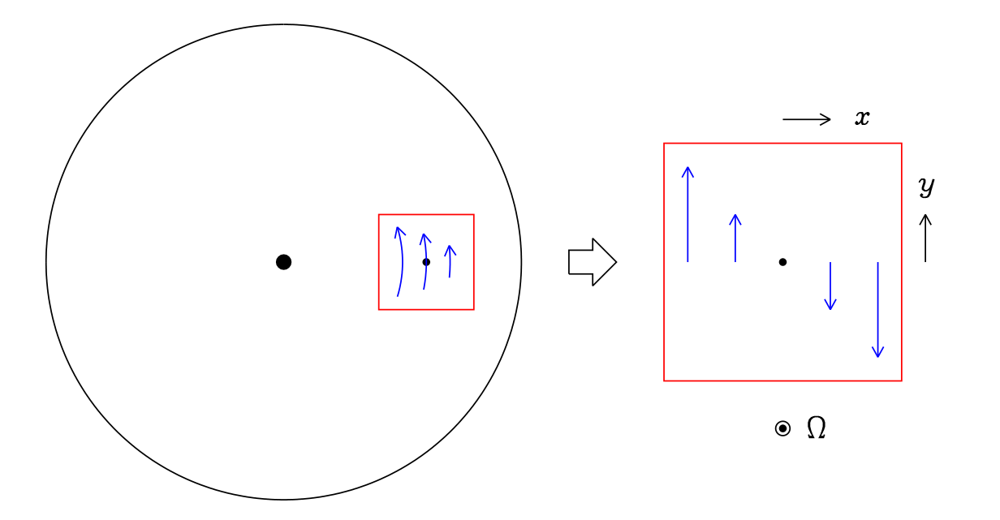
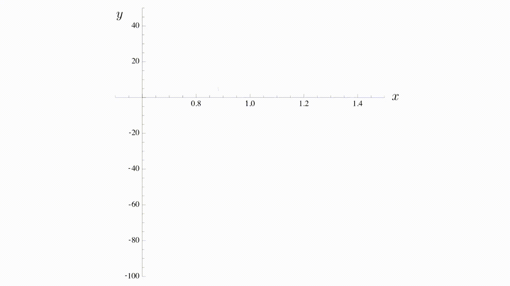
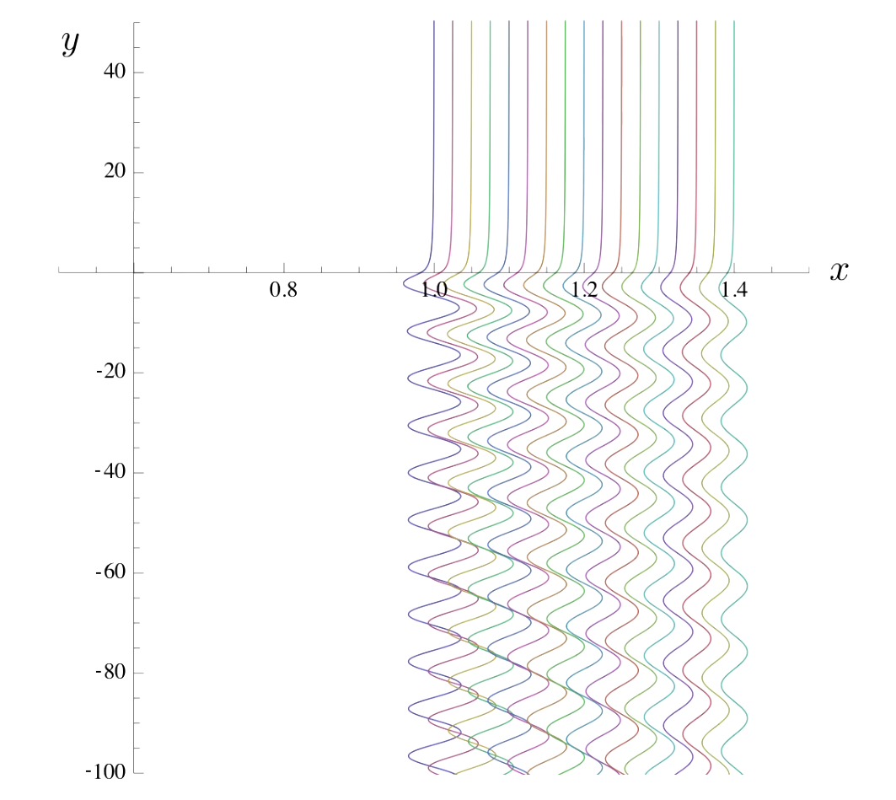

# 25-9-12

1. The satellite/particle-disc interaction

[the slides](https://jingliangwei.github.io/blog/slides/group_meeting.25-9-12.html#/)

2. paper [yang-li-24](/read/disk-satellite#yang-li-2024)

## Background Tools (Lecture 3)

The local view of orbital dynamics

- Local coordinates $(x,y)$
  $$
  r=r_0+x,\quad\phi=\Omega_0t+\frac{y}{r_0}.
  $$
  

- The orbital shear rate
  $$
  S=-r\frac{\mathrm{d}\Omega}{\mathrm{d}r}.
  $$

- The equations of motion in the local view is
  $$
  \begin{align}
  \ddot{x}-2\Omega\dot{y}&=2\Omega Sx, \\
  \ddot{y}+2\Omega\dot{x}&=0.
  \end{align}
  $$

- The family of circular orbits is
  $$
  x=x_0, \quad \dot{y}=-Sx_0.
  $$

- The general solution of the local equations of motion reads
  $$
  \begin{align}
  x&=x_0+\text{Re}\left(Ae^{-i\Omega_rt}\right), \\
  y&=y_0-S_0x_0t+\text{Re}\left(\frac{2\Omega A}{i\Omega_r}e^{-i\Omega_r t}\right).
  \end{align}
  $$

## Lecture 15: Satellite-disc interaction

::: tip summary
1. Lagrange's equations $\dfrac{\mathrm{d}}{\mathrm{d}t}\dfrac{\partial L}{\partial \dot{q}}=\dfrac{\partial L}{\partial q}$ $\rightarrow$ 
$
\left\{\begin{array}{l}
x=x_0+\text{Re}\left(Ae^{-i\Omega_r t}\right), \\
y=y_0-Sx_0t+\text{Re}\left(\dfrac{2\Omega A}{i\Omega_r}e^{-i\Omega_r t}\right)
\end{array}\right.
$ $\rightarrow$ $p_y(\Omega_r),A$ $\rightarrow$ 
$\ \dot{p}_y,\dot{A}\sim\Psi,\ \varepsilon$
2. $\Psi$ $\rightarrow$ $\Delta A\propto x_0^{-3},\Delta p_y\propto x_0^{-5}$
3. another approximation $\Delta v_\parallel\propto x_0^{-5}$
4. the force/torque
:::

### 15.1 Excitation of epicyclic motion by a satellite

- The equations of motion in local view
  $$
  \begin{align}
  \ddot{x}-2\Omega\dot{y}&=2\Omega Sx-\frac{\partial\Psi}{\partial x}, \\
  \ddot{y}+2\Omega\dot{x}&=-\frac{\partial\Psi}{\partial y},
  \end{align}
  $$
  where the potential of the satellite is
  $$
  \Psi(x,y)=-\frac{GM_s}{\sqrt{x^2+y^2}}.
  $$

  ::: details derivation
  The Lagrangian for a particle of unit mass,
  $$
  \begin{align}
  L&=\frac{1}{2}\left(\dot{r}^2+r^2\dot{\phi}^2\right)-\underbrace{\Phi(r)}_{\text{centrifugal potential}}-\underbrace{\Psi(r\cos\phi,r\sin\phi)}_{\text{from satellite}} \\
  &=\frac{1}{2}\left(\dot{x}^2+(r_0+x)^2\left(\Omega_0+\frac{\dot{y}}{r_0}\right)^2\right)-\Phi(r_0+x)-\Psi(x,y),
  \end{align}
  $$
  to second order in $(x,y)$ to obtain
  $$
  L=L_0+L_1+L_2+...,
  $$
  where
  $$
  \begin{align}
  L_0&=\frac{1}{2}r_0^2\Omega_0^2-\Phi_0=\text{constant}, \\
  L_1&=r_0\Omega_0\dot{y}+(r_0\Omega_0^2-\partial_r\Phi|_{(0,0)})x=r_0\Omega_0\dot{y}=\frac{\mathrm{d}}{\mathrm{d}t}(r_0\Omega_0y), \\
  L_2&=\frac{1}{2}\left(\dot{x}^2+\dot{y}^2\right)+2\Omega_0x\dot{y}+\frac{1}{2}\Omega_0^2x^2-\frac{1}{2}\partial^2_{rr}\Phi|_{(0,0)}x^2-\Psi(x,y).
  \end{align}
  $$
  The terms $L_0$ (a constant) and $L_1$ (a total time-derivative) make no contribution to Lagrange's equations.  
  The radial potential satisfies,
  $$
  \partial_r\Phi|_{(0,0)}=r_0\Omega_0^2\quad\Rightarrow\quad\partial^2_{rr}\Phi|_{(0,0)}=\Omega_0^2-2\Omega_0 S_0,
  $$
  $$
  \Rightarrow L_2=\frac{1}{2}\left(\dot{x}^2+\dot{y}^2\right)+2\Omega_0x\dot{y}+\Omega_0 S_0x^2-\Psi(x,y).
  $$
  The motion due to $L_2$ is
  $$
  \begin{align}
  \ddot{x}&=2\Omega_0\dot{y}+2\Omega_0 S_0x-\frac{\partial\Psi}{\partial x}, \\
  \ddot{y}+2\Omega_0\dot{x}&=-\frac{\partial\Psi}{\partial y}.
  \end{align}
  $$
  :::

- Express $\Omega_r$ and $A$ in terms of position and velocity:
  $$
  \begin{align}
  p_y&=\frac{\Omega_r^2}{2\Omega}x_0, \\
  A&=\left[-\frac{2\Omega}{\Omega_r^2}(\dot{y}+Sx)+\frac{i\dot{x}}{\Omega_r}\right]e^{i\Omega_r t}.
  \end{align}
  $$

  ::: details derivation
  From Lecture 3, we have
  $$
  \left\{\begin{array}{l}
  x=x_0+\text{Re}\left(Ae^{-i\Omega_r t}\right), \\
  y=y_0-Sx_0t+\text{Re}\left(\dfrac{2\Omega A}{i\Omega_r}e^{-i\Omega_r t}\right).
  \end{array}\right.
  $$
  $$
  \Rightarrow\left\{\begin{array}{l}
  \dot{x}=\text{Re}\left(-i\Omega_rAe^{-i\Omega_rt}\right)=\Omega_r\text{Im}\left(Ae^{-i\Omega_rt}\right), \\
  \begin{align}
  \dot{y}&=-Sx_0-2\Omega\text{Re}\left(Ae^{-i\Omega_rt}\right) \\
  &=-Sx-(2\Omega-S)\text{Re}\left(Ae^{-i\Omega_rt}\right).
  \end{align}
  \end{array}\right.
  $$
  The canonical $y$-momentum (per unit mass) is
  $$
  \begin{align}
  p_y&=\frac{\partial L_2}{\partial \dot{y}}=\dot{y}+2\Omega x \\
  &=-Sx_0-2\Omega\text{Re}\left(Ae^{-i\Omega_r t}\right)+2\Omega\left(x_0+\text{Re}\left(Ae^{-i\Omega_r t}\right)\right)=(2\Omega-S)x_0,
  \end{align}
  $$
  as we know, the epicyclic frequency $\Omega_r$ (also denoted $\kappa$ ) satisfies $\Omega_r^2=2\Omega(2\Omega-S)$
  $$
  \Rightarrow p_y=\frac{\Omega_r^2}{2\Omega}x_0.
  $$
  And we can find the epicyclic amplitude from
  $$
  \begin{align}
  Ae^{-i\Omega_rt}&=\text{Re}\left(Ae^{-i\Omega_rt}\right)+i\text{Im}\left(Ae^{-i\Omega_rt}\right) \\
  &=-\frac{\left(\dot{y}+Sx\right)}{(2\Omega-S)}+\frac{i\dot{x}}{\Omega_r}
  \end{align}
  $$
  $$
  \Rightarrow A=\left[-\frac{2\Omega}{\Omega_r^2}\left(\dot{y}+Sx\right)+\frac{i\dot{x}}{\Omega_r}\right]e^{i\Omega_rt}.
  $$
  :::

- The excitation by a satellite is
  $$
  \begin{align}
  \dot{p}_y&=-\frac{\partial\Psi}{\partial y}, \\
  \varepsilon+\Psi&=\text{constant}, \\
  \dot{A}&=\left(\frac{2\Omega}{\Omega_r^2}\frac{\partial\Psi}{\partial y}-\frac{i}{\Omega_r}\frac{\partial\Psi}{\partial x}\right)e^{i\Omega_r t},
  \end{align}
  $$
  where the specific energy $\varepsilon$ is
  $$
  \varepsilon=\frac{1}{2}\Omega_r^2|A|^2-\frac{\Omega S}{\Omega_r^2}p_y^2.
  $$

  ::: details derivation
  - The change rate of amplitude $\dot{A}$:
    $$
    \begin{align}
    \dot{A}&=\left[-\frac{2\Omega}{\Omega_r^2}\left(\ddot{y}+S\dot{x}\right)+\frac{i\ddot{x}}{\Omega_r}-\frac{2i\Omega}{\Omega_r}\left(\dot{y}+Sx\right)-\dot{x}\right]e^{i\Omega_rt},
    \end{align}
    $$
    with the aid of $\Omega_r^2=4\Omega^2-2\Omega S$, we obtain
    $$
    \begin{align}
    \dot{A}&=\left[-\frac{2\Omega}{\Omega_r^2}\left(\ddot{y}+2\Omega\dot{x}\right)+\frac{i}{\Omega_r}\left(\ddot{x}-2\Omega\dot{y}-2\Omega Sx\right)\right]e^{i\Omega_rt}, \\
    &=\left(\frac{2\Omega}{\Omega_r^2}\frac{\partial\Psi}{\partial y}-\frac{i}{\Omega_r}\frac{\partial\Psi}{\partial x}\right)e^{i\Omega_r t}.
    \end{align}
    $$

  - The specific energy $\varepsilon$ (contains kinetic energy and the centrifugal potential):
    $$
    \varepsilon=\frac{1}{2}\left(\dot{x}^2+\dot{y}^2\right)-\Omega Sx^2
    $$
    $$
    \Omega_rA=\left[-\frac{2\Omega}{\Omega_r}\left(\dot{y}+Sx\right)+i\dot{x}\right]e^{i\Omega_rt}
    $$
    $$
    \begin{align}
    \Omega_r^2|A|^2&=\dot{x}^2+\frac{4\Omega^2}{\Omega_r^2}\left(\dot{y}+Sx\right)^2 \\
    &=2\varepsilon-\dot{y}^2+2\Omega Sx^2+\frac{4\Omega^2}{\Omega_r^2}\left(\dot{y}+Sx\right)^2 \\
    &=2\varepsilon+\frac{2\Omega S}{\Omega_r^2}\dot{y}^2+\frac{8\Omega^2S}{\Omega_r^2}\dot{y}x+\frac{8\Omega^3S}{\Omega_r^2}x^2 \\
    &=2\varepsilon+\frac{2\Omega S}{\Omega_r^2}\left(\dot{y}+2\Omega x\right)^2
    \end{align}
    $$
    $$
    \Rightarrow\varepsilon=\frac{1}{2}\Omega_r^2|A|^2-\frac{\Omega S}{\Omega_r^2}p_y^2
    $$
  :::

### 15.2 The Perturbation

- The change of amplitude $\Delta A$:
  $$
  \Delta A=-iC\frac{GM_s}{\Omega_rSx_0^2}
  $$
  where
  $$
  C=f\left(\frac{\Omega_r}{S}\right)-\frac{2\Omega}{\Omega_r}f'\left(\frac{\Omega_r}{S}\right)
  $$
  $$
  f(k)=\int_{-\infty}^\infty\left(1+x^2\right)^{-3/2}\cos kx\mathrm{d}x=2kK_1(k)\quad(k>0)
  $$
  here $K_1$ is a modified Bessel function.

  ::: details derivation
  The basic state is an unperturbed circular orbit ( $A=0$ ) at radial separation $x_0$ from the satellite:
  $$
  x=x_0=\text{constant},\quad y=-Sx_0t.
  $$
  With $\Psi=-GM_s\left(x^2+y^2\right)^{-1/2}$,
  $$
  \begin{align}
  \dot{A}&=\left(\frac{2\Omega}{\Omega_r^2}\frac{\partial\Psi}{\partial y}-\frac{i}{\Omega_r}\frac{\partial\Psi}{\partial x}\right)e^{i\Omega_rt} \\
  &=GM_s\left(x^2+y^2\right)^{-3/2}\left(\frac{2\Omega y}{\Omega_r^2}-\frac{ix}{\Omega_r}\right)e^{i\Omega_r t} \\
  &\approx-i\frac{GM_s}{\Omega_rx_0^2}\left(1+S^2t^2\right)^{-3/2}\left(1-i\frac{2\Omega}{\Omega_r}St\right)e^{i\Omega_rt},
  \end{align}
  $$
  giving (the real part of the integral $\sin\Omega_rt,t\cos\Omega_rt$ vanishes by symmetry)
  $$
  \begin{align}
  \Delta A&=\int_{-\infty}^\infty\dot{A}\mathrm{d}t \\
  &=-i\frac{GM_s}{\Omega_rx_0^2}\int_{-\infty}^\infty\left(1+S^2t^2\right)^{-3/2}\left(\cos\Omega_rt+\frac{2\Omega}{\Omega_r}St\sin\Omega_rt\right)\mathrm{d}t.
  \end{align}
  $$
  :::

- The change of $y$-momentum $\Delta p_y$:
  $$
  \Delta p_y=\frac{\left(CGM_s\right)^2}{2S^3x_0^5}.
  $$

  ::: details derivation
  Long before and after the encounter, $\Psi\rightarrow0$. Since $\varepsilon+\Psi$ is exactly conserved, $\Delta\varepsilon=0$ in the encounter.
  $$
  \varepsilon=\frac{1}{2}\Omega_r^2|A|^2-\frac{\Omega S}{\Omega_r^2}p_y^2
  $$
  $$
  \Rightarrow\Delta\left(p_y^2\right)=\frac{\Omega_r^4}{2\Omega S}\Delta\left(|A|^2\right).
  $$
  Assume a circular orbit before the encounter:
  $$
  A=0,\quad p_y=\frac{\Omega_r^2}{2\Omega}x_0.
  $$
  Then, after the encounter,
  $$
  A\approx-iC\frac{GM_s}{\Omega_rSx_0^2},
  $$
  $$
  \Delta\left(p_y^2\right)\approx 2p_y\Delta p_y=2\frac{\Omega_r^2}{2\Omega}x_0\Delta p_y=\frac{\Omega_r^4}{2\Omega S}\left(C\frac{GM_s}{\Omega_rSx_0^2}\right)^2
  $$
  $$
  \Rightarrow\Delta p_y=\frac{\left(CGM_s\right)^2}{2S^3x_0^5}.
  $$
  :::

### 15.3 Impulse approximation

- the change of $y$-velocity $\Delta v_\parallel$:
  $$
  \Delta v_\parallel\approx-\frac{(GM_s)^2}{2S^3x_0^5}
  $$

  ::: details derivation
  $$
  v_\parallel=Sx_0
  $$
  $$
  \Delta v_\perp\approx\frac{GM_s}{x_0^2}\frac{1}{S} \quad\text{(acceleration}\times\text{time)}
  $$
  $$
  \Delta\left(v_\perp^2\right)+\Delta(v_\parallel^2)=0 \quad\text{(conservation of energy)}
  $$
  $$
  \left(\frac{GM_s}{Sx_0^2}\right)^2+2Sx_0\Delta v_\parallel\approx0
  $$
  $$
  \Rightarrow\Delta v_\parallel\approx-\frac{(GM_s)^2}{2S^3x_0^5}
  $$
  :::

### ~~16.1~~ 15.4 Satellite-disc torques

- The $y$ component of the force on the disc, per unit $x$, at location $x$, is
  $$
  F_y(x)=\frac{(CGM_s)^2}{2S^3x^5}\cdot\Sigma\cdot|Sx|\propto x^{-4}\text{sgn}(x).
  $$
  The torque per unit radius is the same $\times r_0$. The satellite experiences an equal and opposite torque.
  ::: info results
  - The effect is of second order in $M_s$
  - Angular-momentum transport is outward
  - The one-sided torque leads to gap opening if $M_s$ is large enough and $\nu$ small enough
  - Asymmetries between inner and outer torques lead to a net torque on the satellite and to migration
  :::
  ::: details derivation
  $$
  F_y=\frac{\Delta p}{\Delta t}=\Delta p_y\times\text{surface density}\times\text{encounter rate}
  $$
  :::

## Lecture 16: Particle-disc interaction

::: tip summary
1. drag force, acceleration $\gamma$
2. zonal flow $v_y(x)$ $\rightarrow$ drift $w_x,w_y$
3. the equation of motion + the flow inside an equilibrium elliptical vortex patch $\rightarrow$ the requirement of trapping $r>3$
:::

### 16.2 Drag forces on particles

- A particle of mass $m$ with velocity $\dot{\boldsymbol{x}}$ moving in a gas with velocity $\boldsymbol{u}(\boldsymbol{x},t)$ experiences a relative wind velocity $\boldsymbol{u}-\dot{\boldsymbol{x}}$ and a drag force
  $$
  \boldsymbol{F}=k(\boldsymbol{u}-\dot{\boldsymbol{x}}).
  $$
  For subsonic relative motion ( $|\boldsymbol{u}-\dot{\boldsymbol{x}}|\ll v_s$ ), the coefficient $k$ can be regarded as independent of the relative velocity if either
  - the size of the particle is small compared to the mean free path of the gas (the kinetic regime, *Epstein drag*), or
  - the Reynolds number of the relative motion is small, resulting in a laminar fluid flow around it (the laminar hydrodynamic regime, *Stokes drag*).

- The acceleration of the particle due to drag can then be written as
  $$
  \frac{\boldsymbol{F}}{m}=\gamma(\boldsymbol{u}-\dot{\boldsymbol{x}})=\frac{\boldsymbol{u}-\dot{\boldsymbol{x}}}{t_s},
  $$
  where $t_s=m/k$ is the *stopping time* and $\gamma=1/t_s$. The stopping time is an increasing function of particle size.

### 16.3 Radial drift

- In the local approximation, the equation of motion of a solid particle is
  $$
  \begin{align}
  \ddot{x}-2\Omega\dot{y}&=2\Omega Sx+\gamma(u_x-\dot{x}), \\
  \ddot{y}+2\Omega\dot{x}&=\gamma(u_y-\dot{y}), \\
  \ddot{z}&=-\Omega_z^2z+\gamma(u_z-\dot{z}).
  \end{align}
  $$
  If we take the gas velocity to be the orbital shear flow $\boldsymbol{u}=-Sx\boldsymbol{e}_y$, then the equations are linear. Both the horizontal (epicyclic) and vertical oscillations of the particle are damped. (The amplitude of the oscillations decays $\propto e^{-\gamma t}$ )

  ::: details derivation
  $$
  \begin{align}
  &\ddot{x}+\Omega_r^2 x=2\Omega p_y \\
  \rightarrow \quad&\ddot{x}-\gamma\dot{x}+\Omega_r^2x=2\Omega p_y
  \end{align}
  $$
  :::

- The velocity of particle's drift
  $$
  w_x=\left(\frac{\text{St}}{1+\text{St}^2}\right)\frac{1}{\Omega_r}\frac{1}{\Sigma}\frac{\partial P}{\partial x},\quad w_y=\frac{v_y}{1+\text{St}^2}.
  $$

  ::: details derivation
  Allow for a small departure from the orbital shear flow, so that
  $$
  \boldsymbol{u}=[-Sx+v_y(x)]\boldsymbol{e}_y.
  $$
  The radial force balance for the gas associates the zonal flow $v_y(x)$ with a radial pressure gradient. In a 2D model,
  $$
  -2\Omega v_y=-\frac{1}{\Sigma}\frac{\partial P}{\partial x}.
  $$
  Write the particle velocity as
  $$
  \dot{\boldsymbol{x}}=-Sx\boldsymbol{e}_y+\boldsymbol{w}.
  $$
  Then the equation of motion of the particle is
  $$
  \begin{align}
  \dot{w}_x-2\Omega w_y&=\gamma(-w_x), \\
  \dot{w}_y+(2\Omega-S)w_x&=\gamma(v_y-w_y), \\
  \dot{w}_z&=-\Omega_z^2z+\gamma(-w_z). \\
  \end{align}
  $$
  To the extent that $v_y$ can be treated as a constant, a steady solution for the dust velocity is given by $w_z=z=0$ and
  $$
  \begin{align}
  -2\Omega w_y&=-\gamma w_x, \\
  (2\Omega-S)w_x&=\gamma(v_y-w_y), \\
  \end{align}
  $$
  which gives
  $$
  w_x=\left(\frac{2\Omega\gamma}{\gamma^2+\Omega_r^2}\right)v_y,\quad w_y=\left(\frac{\gamma^2}{\gamma^2+\Omega_r^2}\right)v_y.
  $$
  In terms of the dimensionless *Stokes number*
  $$
  \text{St}=\Omega_r t_s=\frac{\Omega_r}{\gamma},
  $$
  we have
  $$
  w_x=\left(\frac{\text{St}}{1+\text{St}^2}\right)\frac{1}{\Omega_r}\frac{1}{\Sigma}\frac{\partial P}{\partial x},\quad w_y=\frac{v_y}{1+\text{St}^2}.
  $$
  :::

### 16.4 Trapping of dust in a vortex

- The flow inside an equilibrium elliptical vortex patch of aspect ratio $r=a/b$ and strength $\zeta_0$
  $$
  \boldsymbol{u}=A\left(\frac{y}{r},-rx\right),\quad A=\frac{S}{r-1},\quad\frac{\zeta_0}{S}=-\frac{(r+1)}{r(r-1)}.
  $$

- Vortices of shapes that satisfy $-\Omega_r^2<\Omega\zeta_0<-A^2$ ( $r>3$ for a Keplerian disc) trap particles of all sizes.
  
  ::: details derivation
  The equation of motion of a particle inside the vortex is
  $$
  \begin{align}
  \ddot{x}-2\Omega \dot{y}&=2\Omega Sx-\gamma(\dot{x}-u_x), \\
  \ddot{y}+2\Omega\dot{x}&=-\gamma(\dot{y}-u_y).
  \end{align}
  $$
  This is a linear system with solutions $x,y\propto e^{\lambda t}$:
  $$
  \left(\begin{array}{cc}
  \lambda^2+\gamma\lambda-2\Omega S & -2\Omega\lambda-\gamma Ar^{-1} \\
  2\Omega\lambda+\gamma Ar & \lambda^2+\gamma \lambda
  \end{array}\right)\left(\begin{array}{c}
  x \\
  y
  \end{array}\right)=\left(\begin{array}{c}
  0 \\
  0\end{array}\right)
  $$
  $$
  \left(\lambda^2+\gamma\lambda-2\Omega S\right)\left(\lambda^2+\gamma\lambda\right)+\left(2\Omega\lambda+\gamma Ar^{-1}\right)\left(2\Omega\lambda+\gamma Ar\right)=0
  $$
  $$
  \lambda^4+2\gamma\lambda^3+\left(\gamma^2+\Omega_r^2\right)\lambda^2-2\Omega\zeta_0\gamma\lambda+\gamma^2A^2=0
  $$
  The solutions all decay provided that $\text{Re}(\lambda)<0$ for all four roots of the quartic equation.  
  Assume that $\Omega_r^2>0$; otherwise we have orbital and hydrodynamic instability.
  - In the limit of large $\gamma$ (small $\text{St}$, small particles),  
    the product of roots is $O(\gamma^2)$ and the sum of roots is $O(\gamma^1)$.  
    Two roots are $O(\gamma^1)$ and two are $O(\gamma^0)$.  
    The first scaling gives the balance $\lambda^4+2\gamma\lambda^3+\gamma^2\lambda^2\sim0$, i.e. $\lambda\sim-\gamma$ (twice).  
    These solution decay.  
    The second scaling gives the balance $\gamma^2\lambda^2+\gamma^2A^2\sim 0$, i.e. $\lambda\sim\pm iA$.  
    Expanding further, with $\lambda\sim\pm iA+c\gamma^{-1}$, gives, at $O(\gamma^{1})$, $2(\pm iA)^3+2(\pm iA)c-2\Omega\zeta_0(\pm iA)=0$, i.e. $c=A^2+\Omega\zeta_0$.  
    These solution decay if $\Omega\zeta_0<-A^2$.
  - In the limit of small $\gamma$ (large $\text{St}$, large particles),  
    the product of roots is $O(\gamma^2)$ and the sum of roots is $O(\gamma^1)$.  
    Two roots are $O(\gamma^0)$ and two are $O(\gamma^1)$.  
    The first scaling gives the balance $\lambda^4+\Omega_r^2\lambda^2\sim0$, i.e. $\lambda\sim\pm i\Omega_r$.  
    Expanding further, with $\lambda\sim\pm i\Omega_r+c\gamma$, gives, at $O(\gamma^1)$, $4(\pm i\Omega_r)^3c+2(\pm i\Omega_r)^3+2\Omega_r^2(\pm i\Omega_r)c-2\Omega\zeta_0(\pm i\Omega_r)=0$, i.e. $c=-1-(\Omega\zeta_0/\Omega_r^2)$.  
    These solutions decay if $\Omega\zeta_0>-\Omega_r^2$.  
    The second scaling gives the balance $\Omega_r^2\lambda^2-2\Omega\zeta_0\gamma\lambda+\gamma^2A^2=0$, i.e. $\lambda\sim(\Omega\zeta_0\pm\sqrt{(\Omega\zeta_0)^2-\Omega_r^2A^2})(\gamma/\Omega_r^2)$.  
    These solutions decay if $\Omega\zeta_0<0$.

  For all roots to decay in both limits, we require $-\Omega_r^2<\Omega\zeta_0<-A^2$. For a Keplerian disc this translates into anticyclonic vortices with $r>3$. Vortices of such shapes trap particles of all sizes.
  :::

## Appendix

1. Vieta's Theorem:  
   For a quartic equation $x^4+ax^3+bx^2+cx+d=0$, which has 4 roots denoted $x_1,x_2,x_3,x_4$. The equation can rewritten as
   $$
   \begin{align}
   &(x-x_1)(x-x_2)(x-x_3)(x-x_4) \\
   =\ &x^4-\left(\sum_{i=1}^4x_i\right)x^3+\cdots+\left(\prod_{i=1}^4x_i\right) \\
   =\ &x^4+ax^3+bx^2+cx+d=0
   \end{align}
   $$

2. Translate $-\Omega_r^2<\Omega\zeta_0<-A^2$ to $r>3$ for a Keplerian disc ( $\Omega_r=\Omega$ ):  
   $$
   \frac{\zeta_0}{S}=-\frac{(r+1)}{r(r-1)}\Rightarrow \zeta_0=S\left(-\frac{(r+1)}{r(r-1)}\right)=\frac{3}{2}\Omega\left(-\frac{(r+1)}{r(r-1)}\right)
   $$
   $$
   A=\frac{S}{r-1}=\frac{3}{2}\frac{\Omega}{r-1}\Rightarrow A^2=\frac{9}{4}\frac{\Omega^2}{(r-1)^2}
   $$
   - the left part:
     $$
     \begin{align}
     &-\Omega_r^2<\Omega\zeta_0 \\
     \Rightarrow &-\Omega^2<\Omega^2\frac{3}{2}\left(-\frac{(r+1)}{r(r-1)}\right) \\
     \Rightarrow &1>\frac{3}{2}\frac{r+1}{r(r-1)} \\
     \Rightarrow &2r^2-5r-3>0 \\
     \Rightarrow &(2r+1)(r-3)>0
     \end{align}
     $$
   - the right part:
     $$
     \begin{align}
     &\Omega\zeta_0<-A^2 \\
     \Rightarrow &\Omega^2\frac{3}{2}\left(-\frac{(r+1)}{r(r-1)}\right)<-\frac{9}{4}\frac{\Omega^2}{(r-1)^2} \\
     \Rightarrow &-\frac{r+1}{r}<-\frac{3}{2}\frac{1}{r-1} \\
     \Rightarrow &2r^2-3r-2>0 \\
     \Rightarrow &(2r+1)(r-2)>0
     \end{align}
     $$
